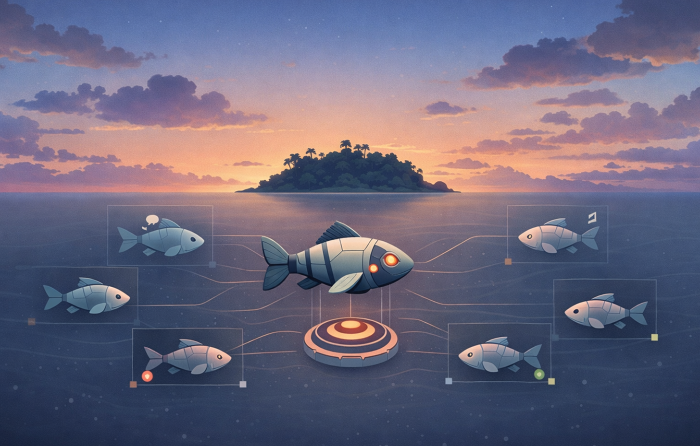

<p align="center">
  
</p>

# <p align="center">Shoal</p>

<p align="center">
  <a href="https://github.com/usm-ricardoroche/shoal"></a>
  <a href="https://github.com/usm-ricardoroche/shoal"></a>
  <a href="https://github.com/usm-ricardoroche/shoal"></a>
  <a href="https://github.com/usm-ricardoroche/shoal"></a>
</p>

<p align="center">
  <strong>Terminal-first orchestration for parallel AI coding agents.</strong>
</p>

---

## TL;DR

<!-- TODO: add this section on what the tool does and why one would use it-->

## Demo

> [!TIP]
> **Coming Soon**: An interactive VHS/Video showing `shoal popup` and the tmux status bar in action.

## Why Shoal?

Shoal was originally designed for the **Fish Shell** environment (hence the name). The concept of a "shoal" of "robo-fish" came from the idea that multiple independent AI agents (the fish) can be coordinated by a single supervisor (the robo-fish) to move as a unified, self-directing unit.

Shoal manages multiple AI coding agents (Claude Code, OpenCode, Gemini) in persistent, branch-aware tmux sessions. It provides a unified control plane with shared MCP servers, automated status detection, and a supervisor "robo-fish" workflow.

## The Analogy: A Robo-Fish in the Shoal

In nature, a shoal of fish moves as a single, self-directing unit. Researchers have demonstrated that biomimetic robot fish can integrate into and even lead schools of real fish by alternating between following and leading behaviors ([Marras & Porfiri 2012](https://royalsocietypublishing.org/doi/10.1098/rsif.2012.0084), [Papaspyros et al. 2019](https://doi.org/10.1371/journal.pone.0220559)).

In your terminal, **Shoal** is the orchestrator—the "robo-fish" that leads a group of independent agent sessions.

- **The Robo**: A supervisory agent that monitors the group, approves actions, and ensures the "shoal" stays on track. Just like the robot fish in research labs that guide real fish schools.
- **The Sessions**: Parallel agents (the fish) working in dedicated git worktrees, synchronized by a shared state and MCP pool.

---

## Features

- 🔄 **Parallel Agent Loops**: Run multiple coding agents simultaneously without context switching.
- 🌿 **Worktree-Native**: Automatically manages git worktrees for every session—keep your main branch clean.
- 🔌 **MCP Pooling**: Shared MCP servers (Memory, Filesystem, GitHub) via a socket proxy—no more duplicate server overhead.
- 🕵️ **Status Detection**: Real-time monitoring of agent states (Thinking, Waiting, Error, Idle) from tmux pane output.
- 🔔 **macOS Notifications**: Native `osascript` notifications tell you the second an agent needs your approval.
- 🤖 **Robo Mode**: A supervisor agent that can "send keys" and "approve" tasks across your entire fleet of agents.
- 🏠 **Environment-First**: Built for tmux. SSH in from your phone, attach to a session inside VS Code, or live in the terminal.
- 🎓 **Interactive Demo**: Try `shoal demo start` to spin up a full environment and learn Shoal hands-on.

---

## Status

Shoal is currently in **Beta**. It is the standard orchestration tool for terminal-first AI workflows at US Mobile.

- **Target Platform**: macOS + tmux 3.3+.
- **Stability**: CLI surface is stabilizing; config keys may change until v1.0.

---

## Install

### Recommended (uv)

```bash
uv tool install .
```

### From source (dev)

```bash
git clone git@github.com:usm-ricardoroche/shoal.git
cd shoal
pip install -e ".[dev]"
```

## Shell Completions

Shoal supports tab-completion for Bash, Zsh, and Fish.

### Zsh

```bash
shoal --install-completion zsh
```

### Bash

```bash
shoal --install-completion bash
```

### Fish (Enhanced Integration)

Shoal provides native fish shell integration with completions, key bindings, abbreviations, and helper functions:

```fish
shoal setup fish
```

This installs:

- **Tab completions** for all commands and dynamic session names
- **Key bindings**: `Ctrl+S` for popup dashboard, `Alt+A` for quick attach
- **Abbreviations**: `sa` (attach), `sl` (ls), `ss` (status), `sp` (popup), etc.
- **Helper functions**: `shoal-quick-attach`, `shoal-dashboard`

See [Fish Integration Guide](docs/FISH_INTEGRATION.md) for full documentation.

For basic completions only (no enhanced features):

```bash
shoal --install-completion fish
```

---

## Concepts

### Sessions & Worktrees

A **Session** is a tmux session tied to a specific tool and directory. If a **Worktree** name is provided, Shoal manages the git worktree and branch lifecycle for you, ensuring that parallel agents never stomp on each other's files.

### MCP Pooling

Instead of every agent starting its own instance of an MCP server, Shoal runs them in a **Pool**. Agents connect via `shoal-mcp-proxy`, allowing them to share state (like a shared Memory server) and reduce resource usage.

### Robo Mode

The **Robo** is a supervisory "super-session." It runs an agent with a specialized prompt (`AGENTS.md`) and access to the Shoal CLI. It can monitor the status of all other agents and interact with them directly—like a robo-fish leading the shoal.

---

## Quick Start

### Try the Interactive Demo

```bash
# Launch a guided demo environment
shoal demo start

# When done:
shoal demo stop
```

### Basic Workflow

```bash
# 1. Create a new agent session in a dedicated worktree
# Use -w to create a worktree, add -b to create a new branch
shoal new -w feature-auth -b

# 2. Open the interactive dashboard to see all sessions
shoal popup

# 3. Check status of running agents
shoal status

# 4. Attach to a session
shoal attach feature-auth
# Or use the picker: shoal attach

# 5. When done, merge and cleanup
shoal wt finish feature-auth --pr
```

`shoal new` defaults to `--tool opencode`. Pass `-t/--tool` to override.

### Flags Explained: `-w` vs `-b`

- **`-w <name>` (Worktree)**: Creates a dedicated git worktree in `.worktrees/<name>`. This keeps your main directory clean and allows parallel agents to work on different files without conflicts.
- **`-b` (Branch)**: When used with `-w`, it explicitly creates a new branch (e.g., `feat/<name>`). Without `-b`, Shoal will use the current branch or default behavior of `git worktree add`.
- **Using Both**: `shoal new -w fix-bug -b` creates a new directory AND a new branch, which is the recommended workflow for parallel tasks.

### Robo Supervisor Workflow

```bash
# Start 3 parallel agents
shoal new -t claude -w feature-ui -b
shoal new -t opencode -w feature-api -b
shoal new -t gemini -w docs -b

# Launch a supervisor to coordinate them
shoal robo setup default --tool opencode
shoal robo start default

# The robo monitors all sessions and can approve actions
shoal robo approve feature-ui
```

See [docs/ROBO_GUIDE.md](docs/ROBO_GUIDE.md) for advanced robo patterns.

---

## Use Cases

### Parallel Feature Development

Work on frontend, backend, and docs simultaneously without context switching:

```bash
shoal new -t claude -w feature-ui -b
shoal new -t opencode -w feature-api -b
shoal new -t gemini -w feature-docs -b
```

Each agent works in its own worktree, with shared MCP servers for memory and filesystem access.

### Code Review Automation

Have one agent write code, another review it:

```bash
shoal new -t claude -w implement-auth -b
shoal new -t gemini -w review-auth -b
# Reviewer can access implementer's worktree via shared filesystem MCP
```

### Overnight Batch Processing

Set up multiple agents with a robo supervisor to route tasks:

```bash
shoal robo setup batch --tool opencode
shoal robo start batch
# Robo monitors agents and assigns tasks from a backlog
```

See [docs/ROBO_GUIDE.md](docs/ROBO_GUIDE.md) for detailed workflows.

---

## Command Reference

### Session Management

| Command        | Alias | Description                                       |
| -------------- | ----- | ------------------------------------------------- |
| `shoal new`    | `add` | Create a new session (optionally with a worktree) |
| `shoal ls`     |       | List sessions grouped by project                  |
| `shoal attach` | `a`   | Attach to a session (fzf picker if no name)       |
| `shoal kill`   | `rm`  | Stop a session and clean up worktrees             |
| `shoal popup`  | `pop` | Open the interactive TUI dashboard                |

### Worktrees (`shoal wt`)

- `ls`: List managed worktrees.
- `finish`: Merge, delete branch, and remove worktree.
- `cleanup`: Remove orphaned worktrees.

### MCP Pool (`shoal mcp`)

- `start/stop`: Manage pooled servers.
- `attach`: Connect a session to a pooled server.

### Demo (`shoal demo`)

- `start`: Spin up a full demo environment with example sessions.
- `stop`: Tear down the demo environment.

### Robo Supervisor (`shoal robo`)

- `start`: Launch the supervisor agent.
- `approve`: Send "Enter" to a waiting agent.
- `send`: Send arbitrary keys to a child session.

---

## Architecture

Shoal is built on a modern async Python stack:

- **FastAPI/Uvicorn**: Provides a local API for state monitoring.
- **SQLite (WAL)**: Concurrent, persistent state management.
- **Typer**: Type-safe CLI interface.
- **Pydantic**: Strict data modeling for configs and state.

---

## Development

See [CONTRIBUTING.md](CONTRIBUTING.md) for setup instructions, [ROADMAP.md](ROADMAP.md) for upcoming features, and [RELEASE_PROCESS.md](RELEASE_PROCESS.md) for versioning details.

**Coverage**: Currently at 52% test coverage (baseline measured 2026-02-16).

---

## Documentation

- [docs/ROBO_GUIDE.md](docs/ROBO_GUIDE.md) — Robo supervisor patterns and workflows
- [CONTRIBUTING.md](CONTRIBUTING.md) — Development setup and guidelines
- [ROADMAP.md](ROADMAP.md) — Upcoming features and milestones
- [RELEASE_PROCESS.md](RELEASE_PROCESS.md) — Versioning and release workflow
- [SECURITY.md](SECURITY.md) — Security policy and vulnerability reporting

---

## License

Proprietary. Copyright (c) 2026 US Mobile.
