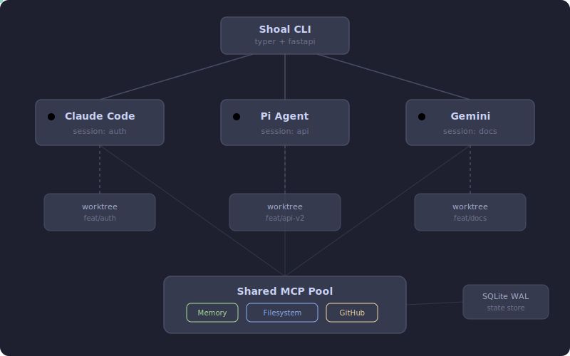

<p align="center">
  
</p>

<p align="center">
  
</p>

<!-- Badges -->
<p align="center">
  
  
  
</p>

<!-- Row 2 — Stack -->
<p align="center">
  
  
  
  
  
  
  
</p>

<!-- Row 3 — Quality -->
<p align="center">
  
  
  
  
</p>

<p align="center">
  <em>Run multiple AI agents in isolated worktrees, coordinate them through a shared control plane, and never context-switch again.</em>
</p>

<p align="center">
  
</p>

---

## TL;DR

You're an engineer running AI coding agents — Claude, Pi, Gemini, OpenCode. You want them working in parallel without stomping on each other's files. You need to know when they're thinking, when they're waiting for approval, and when they've errored out.

**Shoal is `docker-compose` for AI coding agents.** You declare sessions, Shoal gives each one a git worktree, a tmux session, and a shared pool of MCP servers. One command to start. One dashboard to monitor. One CLI to control them all.

> Shoal ecosystem note: this is the orchestration core in a larger multi-repo system (Driftwood Template, Tidepool, Periwinkle, Pisces, Fins, Dotfiles). Integration surfaces are still evolving and are currently documented as work in progress in the meta workspace.

---

## See It in Action

<p align="center">
  
</p>

---

## What You Get

**Parallel agent loops** let you run multiple coding agents simultaneously. Each agent works in its own tmux session with its own context — no shared terminal, no conflicts.

**Worktree isolation** gives every session a dedicated git worktree. Agents work on separate branches in separate directories. Your main branch stays clean.

**MCP server pool** provides shared infrastructure for MCP servers via Unix socket proxying. Each agent connection spawns a fresh MCP process — no duplicate listener overhead.

**Real-time status detection** watches tmux pane output and reports each agent's state: Thinking, Waiting, Error, or Idle. You always know who needs attention.

**Lifecycle hooks** emit events (`session_created`, `session_killed`, `status_changed`) to async Python callbacks and fish shell events. Wire up notifications, logging, or custom automation without touching core code.

**Agent observability** records every status transition in SQLite with timestamps and optional pane snapshots. `shoal history` shows a color-coded timeline; `capture_pane` reads live terminal output via MCP.

**Session graph** tracks fork relationships (`parent_id`), tags, and template provenance. `shoal ls --tree` displays the fork hierarchy; `shoal ls --tag` filters by label.

**Session templates** define window layouts, pane splits, and tool configs in TOML. Templates support inheritance (`extends`) and composition (`mixins`) to eliminate duplication across workflows. Project-local templates in `.shoal/templates/` shadow global ones.

**Session journals** provide append-only markdown logs per session with Obsidian-compatible YAML frontmatter. Search across all journals with `shoal journal --search`. Journals are archived automatically when sessions are killed.

**Remote sessions** let you monitor and control agents on remote machines via SSH tunnel. `shoal remote connect` opens a tunnel; `shoal remote ls` and `shoal remote send` work through it.

**Shoal MCP server** exposes orchestration tools (list, create, kill, send keys, capture pane, read history) via FastMCP so agents can call Shoal natively — enabling robo supervisor workflows where agents manage other agents.

**Robo supervisor** runs an autonomous supervision loop that polls agent status, auto-approves known-safe prompts, and escalates ambiguous cases to an LLM agent session. Run it as a foreground process or a background daemon.

**Diagnostics** built in — `shoal diag` checks DB connectivity, watcher PID, tmux reachability, and MCP sockets. `shoal mcp doctor` runs protocol-level health checks on pooled servers.

---

## How It Works

<p align="center">
  
</p>

1. **You run `shoal new`** — Shoal creates a tmux session, optionally provisions a git worktree and branch, and launches your chosen AI tool inside it.

2. **Each agent gets isolation** — Separate worktree, separate branch, separate tmux session. Agents cannot interfere with each other's files.

3. **MCP servers are pooled** — Instead of each agent spawning its own MCP servers, Shoal runs a shared pool. Agents connect through `shoal-mcp-proxy` for shared infrastructure (each connection spawns a fresh MCP process).

4. **Status is tracked continuously** — A background monitor reads tmux pane output, matches patterns against tool-specific configs, and writes state to a SQLite WAL database. Every transition is recorded with timestamps. The FastAPI server exposes this via a local API.

5. **You control everything from one CLI** — `shoal status` shows all agents. `shoal popup` opens a TUI dashboard. `shoal attach` jumps into any session. `shoal robo watch` launches a supervisor to automate the whole fleet.

---

## Quick Start

### Prerequisites

Shoal requires these tools on your system:

| Tool | Install | Why |
| ---- | ------- | --- |
| **[uv](https://docs.astral.sh/uv/)** | `curl -LsSf https://astral.sh/uv/install.sh \| sh` | Python package manager — installs Shoal and its dependencies |
| **[fish](https://fishshell.com/)** | `sudo apt install fish` / `brew install fish` | Shell integration — completions, key bindings, abbreviations |
| **[tmux](https://github.com/tmux/tmux)** | `sudo apt install tmux` / `brew install tmux` | Session multiplexer — each agent runs in its own tmux pane |
| **[git](https://git-scm.com/)** | `sudo apt install git` / `brew install git` | Worktree isolation and branch management |
| **[fzf](https://github.com/junegunn/fzf)** | `sudo apt install fzf` / `brew install fzf` | Interactive session picker for `shoal attach` |

Optional:

| Tool | Install | Why |
| ---- | ------- | --- |
| **[gh](https://cli.github.com/)** | `sudo apt install gh` / `brew install gh` | GitHub CLI — used by `shoal wt finish --pr` |
| **[nvr](https://github.com/mhinz/neovim-remote)** | `pip install neovim-remote` | Neovim remote control integration |

> **Minimum versions**: Python 3.12+, tmux 3.3+, fish 3.6+

`shoal init` checks for tmux, git, fzf, gh, and nvr and reports what's missing.

### Install

```bash
# Recommended
uv tool install .

# With MCP support (enables shoal-orchestrator)
uv tool install ".[mcp]"
```

### From Source (dev)

```bash
git clone git@github.com:usm-ricardoroche/shoal.git
cd shoal
uv tool install -e ".[dev,mcp]"
uv tool install pre-commit
just setup                   # install pre-commit + commit-msg hooks
```

### Setup

```bash
shoal init          # create DB, scaffold configs, check dependencies
shoal setup fish    # install fish completions, keybindings, abbreviations
```

`shoal init` creates `~/.config/shoal/` (config, tool profiles, templates) and `~/.local/state/shoal/` (database, MCP sockets). It also checks that required tools are installed and reports anything missing.

### Try the Demo

```bash
shoal demo tutorial   # interactive hands-on walkthrough
shoal demo start      # guided demo environment
shoal demo stop       # tear down when done
```

### 60-Second Workflow

```bash
# Create 3 parallel agents, each in its own worktree
shoal new -t claude -w auth -b
shoal new -t pi -w api-refactor -b
shoal new -t gemini -w docs -b

# Check on everyone
shoal status

# Open the dashboard
shoal popup

# Attach to a session
shoal attach auth

# When done, merge and clean up
shoal wt finish auth --pr
```

`shoal new` defaults to your configured `default_tool`. Pass `-t/--tool` to override.

---

## Use Cases

<details>
<summary><strong>Parallel Feature Development</strong></summary>

Work on frontend, backend, and docs simultaneously:

```bash
shoal new -t claude -w feature-ui -b
shoal new -t pi -w feature-api -b --template pi-dev
shoal new -t gemini -w feature-docs -b
```

Each agent works in its own worktree with pooled MCP server infrastructure.

</details>

<details>
<summary><strong>Code Review Automation</strong></summary>

Have one agent write code, another review it:

```bash
shoal new -t claude -w implement-auth -b
shoal new -t pi -w review-auth -b
# Reviewer accesses implementer's worktree via shared filesystem MCP
```

</details>

<details>
<summary><strong>Autonomous Supervision</strong></summary>

Run a robo supervisor that auto-approves safe prompts and escalates ambiguous cases:

```bash
shoal robo watch default              # foreground supervision loop
shoal robo watch default --daemon     # background daemon mode
shoal robo watch-status default       # check daemon health
```

The supervisor polls agent status, pattern-matches pane content against safe-to-approve rules, and escalates anything ambiguous to a configured LLM agent session.

See [docs/ROBO_GUIDE.md](docs/ROBO_GUIDE.md) for detailed patterns.

</details>

---

## Commands

### Session Management

| Command         | Alias | Description                                       |
| --------------- | ----- | ------------------------------------------------- |
| `shoal new`     | `add` | Create a new session (optionally with a worktree) |
| `shoal ls`      |       | List sessions (`--tag`, `--tree` supported)       |
| `shoal attach`  | `a`   | Attach to a session (fzf picker if no name)       |
| `shoal kill`    | `rm`  | Stop a session and clean up worktrees             |
| `shoal fork`    |       | Fork a session (tracked parent/child graph)       |
| `shoal rename`  |       | Rename a session                                  |
| `shoal info`    |       | Detailed session summary with tags and lineage    |
| `shoal popup`   | `pop` | Open the interactive TUI dashboard                |
| `shoal history` |       | Status transition timeline with durations         |
| `shoal tag`     |       | Add, remove, or list session tags                 |

### Journals (`shoal journal`)

| Command              | Description                                   |
| -------------------- | --------------------------------------------- |
| `<session>`          | View a session's journal                      |
| `--append <message>` | Append an entry to a session journal          |
| `--archived`         | Read archived journals from killed sessions   |
| `--search <query>`   | Search across all session journals            |

### Worktrees (`shoal wt`)

| Command   | Description                               |
| --------- | ----------------------------------------- |
| `ls`      | List managed worktrees                    |
| `finish`  | Merge, delete branch, and remove worktree |
| `cleanup` | Remove orphaned worktrees                 |

### MCP Pool (`shoal mcp`)

| Command    | Description                                    |
| ---------- | ---------------------------------------------- |
| `start`    | Start a pooled MCP server                      |
| `stop`     | Stop a pooled MCP server                       |
| `attach`   | Connect a session to a pooled server            |
| `doctor`   | Protocol-level health check on pooled servers   |
| `registry` | Show configured MCP server registry             |
| `logs`     | View MCP server log files                       |

### Diagnostics & Config

| Command             | Description                                |
| ------------------- | ------------------------------------------ |
| `shoal diag`        | Check DB, watcher, tmux, MCP socket health |
| `shoal config show` | Display resolved configuration             |
| `shoal status`      | Aggregate status counts across all agents  |

### Templates (`shoal template`)

| Command           | Description                             |
| ----------------- | --------------------------------------- |
| `ls`              | List available session templates        |
| `show <name>`     | Display a template's resolved config    |
| `show --raw`      | Display unresolved template (pre-merge) |
| `validate <name>` | Validate a template against the schema  |
| `mixins`          | List available template mixins          |

### Extensions (`shoal fin`)

| Command          | Description                                            |
| ---------------- | ------------------------------------------------------ |
| `inspect <path>` | Show fin manifest metadata and resolved entrypoints    |
| `install <path>` | Execute fin `install` lifecycle entrypoint             |
| `configure <path>`| Execute fin `configure` lifecycle entrypoint          |
| `validate <path>`| Validate manifest and run fin `validate` entrypoint    |
| `run <path>`     | Execute fin `run` with args passthrough after `--`     |
| `ls [--path <dir>]` | List local path-based fin candidates and validity   |

### Demo (`shoal demo`)

| Command    | Description                                           |
| ---------- | ----------------------------------------------------- |
| `start`    | Spin up a full demo environment with example sessions |
| `stop`     | Tear down the demo environment                        |
| `tour`     | Guided 7-step feature walkthrough                     |
| `tutorial` | Interactive hands-on tutorial with real sessions      |

### Robo Supervisor (`shoal robo`)

| Command        | Description                                           |
| -------------- | ----------------------------------------------------- |
| `start`        | Launch the supervisor agent session                   |
| `watch`        | Start the autonomous supervision loop                 |
| `watch --daemon` | Run supervision as a background daemon              |
| `watch-stop`   | Stop a running daemon                                 |
| `watch-status` | Check daemon health                                   |
| `approve`      | Send "Enter" to a waiting agent                       |
| `send`         | Send arbitrary keys to a child session                |

### Remote Sessions (`shoal remote`)

| Command      | Description                           |
| ------------ | ------------------------------------- |
| `ls`         | List configured remote hosts          |
| `connect`    | Open SSH tunnel to remote API         |
| `disconnect` | Close SSH tunnel                      |
| `status`     | Show remote session status summary    |
| `sessions`   | List sessions on remote host          |
| `send`       | Send keystrokes to remote session     |
| `attach`     | Attach to remote tmux session via SSH |

---

## Fish Shell Integration

```fish
shoal setup fish
```

Installs tab completions, key bindings (`Ctrl+S` popup, `Alt+A` attach), abbreviations (`sa`, `sl`, `ss`, `sp`), and helper functions. Fish event hooks (`__shoal_on_waiting`, `__shoal_on_error`) let you wire up notifications without writing Python. See [Fish Integration Guide](docs/FISH_INTEGRATION.md) for details.

For completions only:

```fish
shoal --install-completion fish
```

---

## Supported Tools

| Tool        | Command    | Status    |
| ----------- | ---------- | --------- |
| Pi          | `pi`       | Primary   |
| Claude Code | `claude`   | Supported |
| OpenCode    | `opencode` | Compatible |
| Gemini      | `gemini`   | Supported |

Tool configs live in `~/.config/shoal/tools/<name>.toml` with per-tool detection patterns and
`status_provider` adapters.

OpenCode runs in compatibility mode for status detection (best effort). Pi is the reference
backend for status transitions.

---

## Status

| Milestone   | Focus                                                   | Status   |
| ----------- | ------------------------------------------------------- | -------- |
| **v0.18.0** | Lifecycle hooks, observability, session graph, robo supervisor | Current  |
| **v0.17.0** | Demo overhaul, diagnostics, journals, remote sessions   | Complete |
| **v0.16.0** | Remote sessions via SSH tunnel                          | Complete |
| **v0.15.0** | FastMCP integration, Shoal MCP server                   | Complete |
| **v0.14.0** | Template inheritance and mixins                         | Complete |

See [ROADMAP.md](ROADMAP.md) for the full plan.

---

## Development

```bash
just ci          # all CI checks (lint, typecheck, test, fish-check, security)
just lint        # lint with ruff
just fmt         # auto-format with ruff
just test        # tests (exclude integration)
just typecheck   # mypy --strict
just cov         # tests with coverage report
just setup       # install pre-commit hooks
```

**990 tests** | **82% coverage** | **mypy --strict** | **pre-commit enforced** | **conventional commits**

See [CONTRIBUTING.md](CONTRIBUTING.md) for full setup instructions.

---

## Documentation

- [docs/JOURNALS.md](docs/JOURNALS.md) — Session journals and frontmatter
- [docs/LOCAL_TEMPLATES.md](docs/LOCAL_TEMPLATES.md) — Project-local template guide
- [docs/REMOTE_GUIDE.md](docs/REMOTE_GUIDE.md) — Remote session management guide
- [docs/ROBO_GUIDE.md](docs/ROBO_GUIDE.md) — Robo supervisor patterns and workflows
- [docs/FISH_INTEGRATION.md](docs/FISH_INTEGRATION.md) — Fish shell integration guide
- [docs/HTTP_TRANSPORT.md](docs/HTTP_TRANSPORT.md) — MCP HTTP transport setup
- [docs/CLAUDE_CODE_SETUP.md](docs/CLAUDE_CODE_SETUP.md) — Claude Code integration guide
- [docs/TROUBLESHOOTING.md](docs/TROUBLESHOOTING.md) — Common issues and solutions
- [docs/EXTENSIONS.md](docs/EXTENSIONS.md) — Fin extension capability map and boundaries
- [ARCHITECTURE.md](ARCHITECTURE.md) — System design and concepts
- [CONTRIBUTING.md](CONTRIBUTING.md) — Development setup and guidelines
- [ROADMAP.md](ROADMAP.md) — Upcoming features and milestones
- [RELEASE_PROCESS.md](RELEASE_PROCESS.md) — Versioning and release workflow
- [SECURITY.md](SECURITY.md) — Security policy and vulnerability reporting

---

## License

MIT License. See `LICENSE` for details.

<p align="center">
  
</p>
