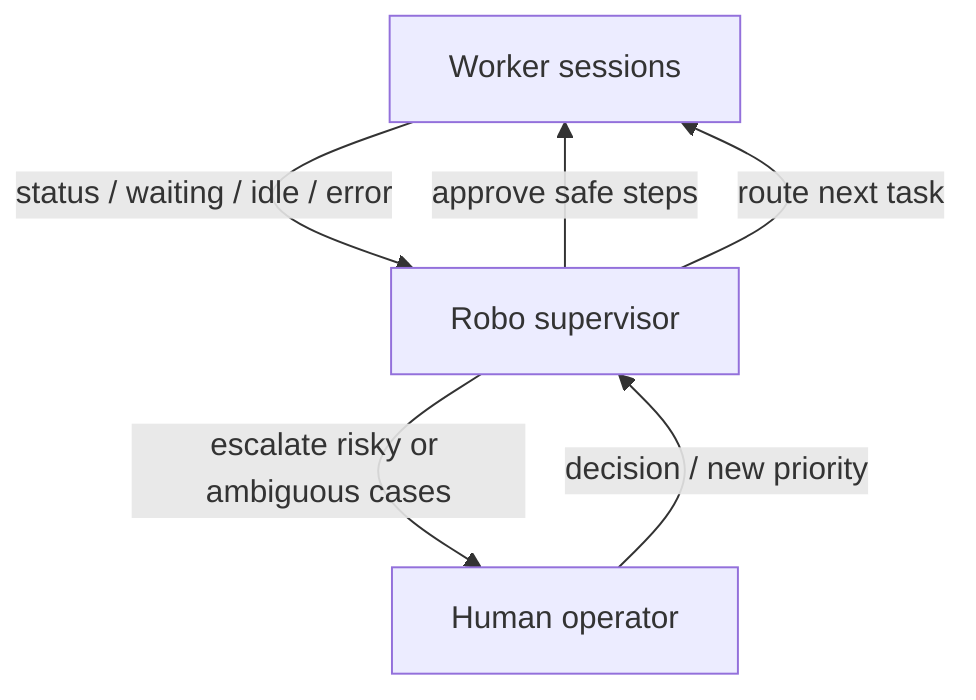
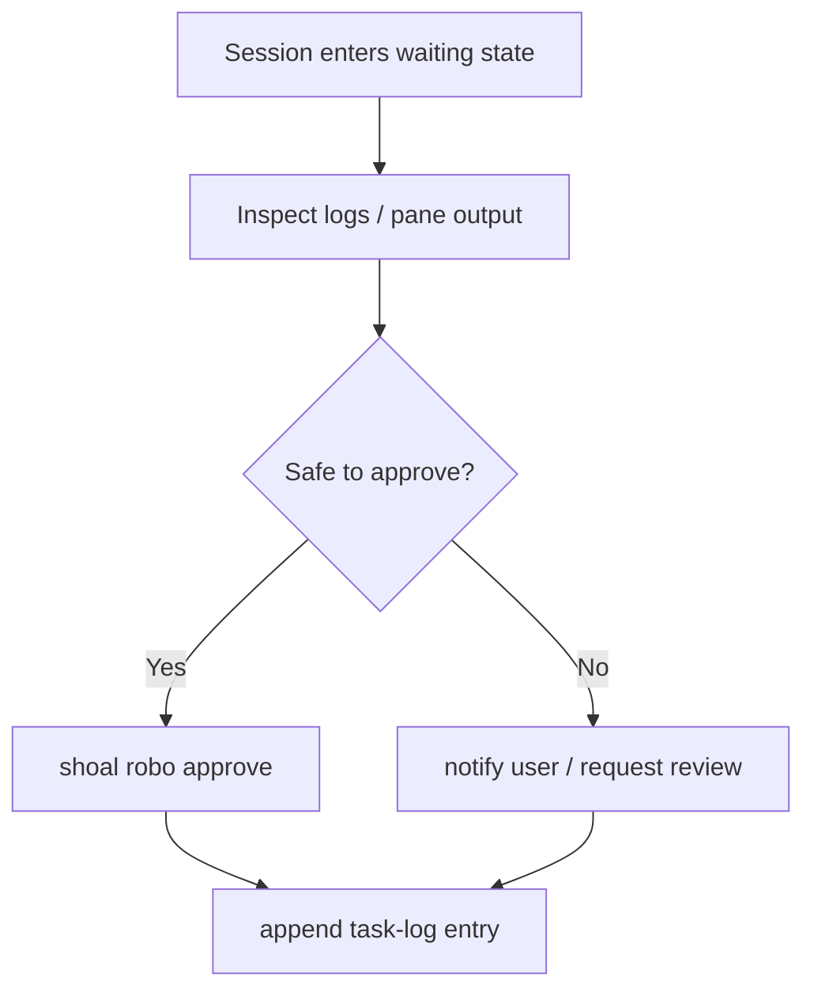

# Robo Supervisor Guide

The **Robo** is Shoal's supervisory agent—a "robo-fish" that monitors and coordinates your fleet of AI coding agents.

## The Robo-Fish Analogy

In nature, researchers demonstrated that biomimetic robot fish can integrate into and lead schools of real fish by alternating between following and leading behaviors ([Marras & Porfiri 2012](https://royalsocietypublishing.org/doi/10.1098/rsif.2012.0084), [Papaspyros et al. 2019](https://doi.org/10.1371/journal.pone.0220559)).

Similarly, Shoal's **Robo** acts as a robot fish that:
- Monitors the "shoal" of agent sessions
- Approves actions when agents are waiting
- Routes tasks and escalates issues
- Maintains cohesion across parallel workflows

## How Robo fits the loop

Read it top to bottom: worker sessions surface events, Robo filters them, and only judgment calls reach the human.



---

## Quick Start

### 1. Create a Robo Profile

```bash
shoal robo setup default --tool opencode
```

This creates:
- `~/.config/shoal/robo/default.toml` — Configuration profile
- `~/.local/share/shoal/robo/default/` — Robo working directory with:
  - `AGENTS.md` — Instructions for the robo agent
  - `task-log.md` — Activity log

The robo supervision daemon also writes its PID and logs under `~/.local/state/shoal/`.

### 2. Start the Robo

```bash
shoal robo start default
```

This launches a tmux session (`__default` by default) running your chosen AI tool (OpenCode, Claude, Codex, Pi, Gemini) with robo-specific instructions.

### 3. Attach to the Robo

```bash
tmux attach -t __default
```

Or use Shoal's session picker:

```bash
shoal attach
# Select "__default" from the list
```

---

## Robo Workflow Patterns

### Pattern 0: Agentic Fan-Out (spawn_team)

**Use case**: A coordinator session spawns parallel workers without human involvement, waits for them all to finish, then acts on results.

This is the preferred approach when agents can self-organize. The coordinator drives the whole loop via MCP tools — no manual `shoal new` calls needed.

**Coordinator prompt** (sent to the supervisor session):
```
You are a supervisor. Use Shoal MCP tools to coordinate work.

1. Call spawn_team with a list of worker specs to fan out parallel workers.
   Each worker gets its own worktree and branch.
2. Call wait_for_team to block until all workers complete.
3. For each worker, call read_worktree_file or capture_pane to collect results.
4. Merge or summarise results, then call mark_complete.
```

**What the MCP tools do**:
```
spawn_team(workers=[
  {"name": "feat/auth-ui",  "prompt": "Implement login form"},
  {"name": "feat/auth-api", "prompt": "Implement JWT endpoint"},
  {"name": "docs/auth",     "prompt": "Write auth guide"},
], template="feature-dev")
# → returns correlation_id, spawned list, any failed

wait_for_team(correlation_id="…")
# → blocks until completed / error / stopped
```

Workers signal done via `mark_complete`. The coordinator receives a `worker_completed` Agent Bus message automatically.

**Result**: The robo drives the full fan-out loop. You never need to create or monitor individual sessions manually.

---

### Pattern 0b: Template-Based Fleet (manual setup)

**Use case**: You want to pre-create sessions with a consistent layout so the robo can coordinate a predictable structure.

**Setup**:
```bash
shoal new -t claude -w feat/auth-ui -b --template feature-dev
shoal new -t omp -w feat/auth-api -b --template feature-dev
shoal new -t omp -w docs/auth-guide -b --template feature-dev
shoal robo start default
```

**Robo instructions**:
```
Supervise all active sessions.
For each waiting/idle session:
1. Check status with `shoal status`
2. Send follow-up with `shoal robo send <session> <keys>`
3. Log routing decisions in task-log.md
```

**Result**: Robo supervises a uniform fleet. Use this when you want to control session setup yourself before handing off to robo.

### Pattern 1: Passive Monitoring

**Use case**: You have 3 agents working on different features. The robo periodically checks their status.

**Setup**:
```toml
# ~/.config/shoal/robo/default.toml
[robo]
tool = "opencode"
auto_approve = false

[monitoring]
poll_interval = 10  # Check every 10 seconds
waiting_timeout = 300  # Escalate after 5 minutes
```

!!! tip
    `poll_interval = 10` is aggressive for a busy fleet. If you have 6+ sessions, raise it to 30–60 to avoid the robo spending most of its attention on status reads.

**Robo instructions** (in the session):
```
Check status every minute with `shoal status`.
If any session is "waiting", investigate using `shoal logs <name>`.
Log findings in task-log.md.
```

**Result**: The robo runs `shoal status` periodically and logs observations. You review the task log to see what happened while you were away.

---

### Pattern 2: Active Approval

**Use case**: Agents need permission to run destructive operations (push to main, delete files, etc.).

**Setup**:
```bash
# Start 3 sessions
shoal new -t claude -w feat/auth -b --template feature-dev
shoal new -t opencode -w feat/api -b --template feature-dev
shoal new -t omp -w fix/cache -b --template feature-dev

# Start robo
shoal robo start approval-bot
```

**Robo instructions**:
```
Monitor all sessions. When a session enters "waiting" state:
1. Check what it's waiting for: `shoal logs <name>` or `capture_pane`
2. If it's a safe operation (tests, linting), approve: `shoal robo approve <name>`
3. If it's risky (force push, delete production), escalate to user
4. Log every approval in task-log.md
```

!!! warning "Approval is not automatic"
    Waiting state does not mean "safe to approve". The robo must read the pane output before approving. Auto-approving based on status alone is how destructive operations get rubber-stamped.

Read it top to bottom: waiting does not automatically mean approve. Robo is supposed to filter routine prompts from decisions that still belong to a human.




**Manual override**:
```bash
# You can also manually approve from your shell
shoal robo approve feature-auth
```

---

### Pattern 3: Task Routing

**Use case**: You have a backlog of tasks. As agents finish, the robo assigns the next task.

**Setup**:
Create a task list in `~/.local/share/shoal/robo/default/tasks.md`:

```md
# Task Backlog

- [ ] Implement user authentication
- [ ] Add rate limiting to API
- [ ] Fix cache invalidation bug
- [ ] Write integration tests
```

**Robo instructions**:
```
Monitor sessions with `shoal status`.
When a session becomes "idle":
1. Check tasks.md for the next unclaimed task
2. Mark it as claimed
3. Use `shoal robo send <name> "<task instruction>"` to send the task
4. Mark it as in-progress in tasks.md
```

**Result**: The robo automatically feeds tasks to idle agents, maximizing parallelism.

---

### Pattern 4: Error Escalation

**Use case**: An agent encounters an LSP error or crashes. The robo detects it and notifies you.

**Setup**:
```toml
# ~/.config/shoal/robo/default.toml
[escalation]
notify = true  # macOS notification
auto_respond = false
```

!!! danger "Do not auto-retry"
    The default instruction is correct: do NOT auto-retry without user confirmation. An agent in error state may have partially executed a destructive step. Retrying blindly can compound the damage.

**Robo instructions**:
```
Check `shoal status` every minute.
If any session is "error" or "crashed":
1. Check logs: `shoal logs <name>` or use `capture_pane` MCP tool
2. Send macOS notification to user
3. Log the error in task-log.md with timestamp
4. Do NOT auto-retry without user confirmation
```

**Result**: You receive a notification when an agent needs attention, even if you're not at your desk.

---

## Robo Commands Reference

| Command | Description |
|---------|-------------|
| `shoal robo setup <name>` | Create a new robo profile |
| `shoal robo start <name>` | Launch the robo session |
| `shoal robo stop <name>` | Terminate the robo session |
| `shoal robo ls` | List all robo sessions |
| `shoal robo approve <session>` | Send "Enter" to approve a waiting agent |
| `shoal robo send <session> <keys>` | Send arbitrary keys to a session |


!!! info

    `shoal robo approve` sends Enter to the waiting pane. It does not parse the prompt — the robo (or you) must have already judged the operation safe.


---

## Configuration Options

### Global Session Prefixes

```toml
# ~/.config/shoal/config.toml

[tmux]
session_prefix = "_"   # Regular shoal sessions: _<name>

[robo]
session_prefix = "__"  # Robo sessions: __<name>
default_tool = "opencode"
default_profile = "default"
```

If a prefix ends with `_`, Shoal appends the session name directly.
Otherwise Shoal inserts `_` between prefix and session name.

### Profile Structure

```toml
# ~/.config/shoal/robo/<name>.toml

[robo]
name = "default"
tool = "omp"  # AI tool to run (omp, claude, opencode, codex)
auto_approve = false  # Auto-approve safe operations?

[monitoring]
poll_interval = 10  # How often to check status (seconds)
waiting_timeout = 300  # Escalate if waiting > this (seconds)

[escalation]
notify = true  # Send macOS notifications?
auto_respond = false  # Auto-respond to permission prompts?

[tasks]
log_file = "task-log.md"  # Where to log robo actions
```

### Runtime Files

- **`AGENTS.md`**: Instructions loaded by the AI tool (modify this to change robo behavior)
- **`task-log.md`**: Append-only log of robo actions (review this to see what happened)
- **`tasks.md`** (optional): Task backlog for routing pattern

---

## Advanced Patterns

### Multi-Repo Coordination

Run a robo for each repository:

```bash
shoal robo setup repo-frontend --tool claude
shoal robo setup repo-backend --tool opencode
shoal robo start repo-frontend
shoal robo start repo-backend
```

Each robo monitors its repo's sessions independently.

### Nested Supervision

Have a "meta-robo" that monitors other robos:

```bash
shoal robo setup meta --tool omp
```

Edit `~/.local/share/shoal/robo/meta/AGENTS.md`:

```md
You are the meta-robo. Monitor all robo sessions:
- `shoal robo ls` to see all robos
- Check their task logs for anomalies
- Escalate if any robo is stuck
```

### MCP Tools for Robo Workflows

Robo supervisors with the `shoal-orchestrator` MCP server can use these tools to coordinate workers:

**Observation and control**

| Tool | Purpose |
|------|---------|
| `list_sessions` | Discover active workers |
| `session_status` | Fleet health at a glance |
| `capture_pane` | See what a worker is doing |
| `send_keys` | Send instructions or approvals |
| `session_snapshot` | Status + last 50 pane lines in one call |

**Team coordination (v0.38.0+)**

| Tool | Purpose |
|------|---------|
| `fork_session` | Spawn a single worker with its own worktree and branch |
| `spawn_team` | Fan-out N worker sessions with prompts and a shared `correlation_id` |
| `wait_for_team` | Block until all team workers reach a terminal state |

**Completion and handoff**

| Tool | Purpose |
|------|---------|
| `mark_complete` | Workers signal "I'm done" |
| `wait_for_completion` | Block until a worker finishes |
| `read_worktree_file` | Read output files from worker worktrees |
| `list_worktree_files` | See what a worker produced |
| `read_journal` / `append_journal` | Cross-session journal communication |
| `branch_status` / `merge_branch` | Git operations without raw `send_keys` |

**Agent Bus messaging**

| Tool | Purpose |
|------|---------|
| `send_session_message` | Send a typed message to another session |
| `receive_session_messages` | Poll unread messages |
| `get_workflow_messages` | Trace all messages by `correlation_id` |

**Proactive (Scout)**

| Tool | Purpose |
|------|---------|
| `get_failure_context` | Read failure context packets captured by Scout; `consume=true` deletes after read |

See [Handoffs & Modes](handoffs-and-modes.md) for the full handoff workflow and [Features Overview](features.md) for Scout and Agent Bus configuration.

---

## Safety Rules


!!! danger "Non-negotiable safety rules"

    1. **Never auto-approve destructive operations** — force push, delete production, or anything irreversible.

    2. **Log every action** in `task-log.md`.

    3. **Prefer asking the user** over making assumptions.


    You can customize these rules by editing `~/.local/share/shoal/robo/<name>/AGENTS.md`.


---

## Troubleshooting

### Robo isn't responding

```bash
# Check if the tmux session is alive
tmux ls | grep robo

# Attach and see what's happening
tmux attach -t __default
```

!!! warning "Robo approved something risky"

    **First**: stop the robo immediately.

    ```bash

    shoal robo stop default

    ```

    Then review `task-log.md` to understand what was approved before deciding whether the agent can continue:

    ```bash

    cat ~/.local/share/shoal/robo/default/task-log.md

    ```


### Can't find robo profile

Shoal looks for profiles in:
1. `~/.config/shoal/robo/<name>.toml` (new path)
2. `~/.config/shoal/conductor/<name>.toml` (old path, backward compat)

If neither exists, run:

```bash
shoal robo setup <name>
```

---

## Examples from the Field

### Example 1: Parallel Feature Development

**Scenario**: You're building a feature that touches frontend, backend, and docs.

```bash
# Create three sessions
shoal new -t claude -w feat/auth-ui -b --template feature-dev
shoal new -t omp -w feat/auth-api -b --template feature-dev
shoal new -t omp -w docs/auth-docs -b --template feature-dev

# Start robo to coordinate
shoal robo start feature-auth-coordinator
```

**Robo task** (you tell it in the session):
```
Monitor these three sessions. When all three are "idle":
1. Check that tests pass in each
2. If all pass, notify me to review and merge
3. If any fail, send the error to the other agents for context
```

### Example 2: Overnight Batch Processing

**Scenario**: You have 10 refactoring tasks. Set up sessions and let the robo route them overnight.

```bash
# Create 4 worker sessions
shoal new -t claude -w chore/worker-1 -b --template feature-dev
shoal new -t omp -w chore/worker-2 -b --template feature-dev
shoal new -t omp -w chore/worker-3 -b --template feature-dev
shoal new -t claude -w chore/worker-4 -b --template feature-dev

# Start robo
shoal robo start overnight-batch
```

**tasks.md**:
```md
- [ ] Refactor auth module
- [ ] Refactor API handlers
- [ ] Refactor DB models
- [ ] Refactor tests
- [ ] Update docs
...
```

**Robo task**:
```
Route tasks from tasks.md to idle workers.
Mark completed tasks.
Log any errors for morning review.
```

**Morning review**:
```bash
cat ~/.local/share/shoal/robo/overnight-batch/task-log.md
```

---

## Further Reading

- [Shoal Overview](index.md) — Overview of Shoal
- [Python API Reference](reference/python-api.md) — Programmatic access to session state
- [CLI Reference](cli-reference.md) — Robo command surface and entry points
