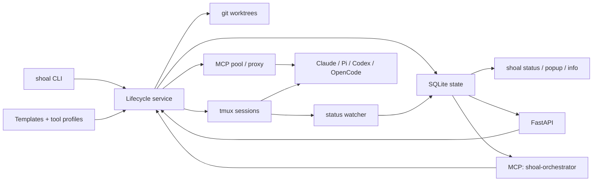
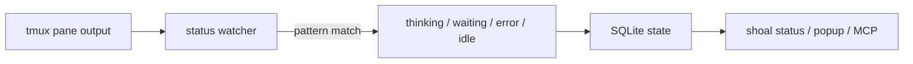
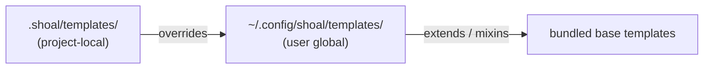

# Architecture

Shoal is a local control plane for AI coding agents. It combines tmux for process isolation,
SQLite for durable state, FastAPI for local HTTP access, and an MCP pool for tool sharing.

Read the system in two passes:
- **Write path**: operator commands flow into the lifecycle layer, which creates worktrees, tmux sessions, and MCP attachments.
- **Read path**: the watcher records runtime state in SQLite, and every surface reads from that shared truth instead of scraping tmux independently.

!!! info "Two passes"
    **Write path** — commands flow in and work gets created: worktrees, sessions, MCP attachments.
    **Read path** — the watcher records state in SQLite; every surface reads from there instead of scraping tmux live.

## Core components

### Session manager

The CLI creates, lists, forks, renames, and kills sessions. Each session gets a durable state
record plus a tmux target that Shoal can reattach to later.

### Worktree layer

When you create a worktree-backed session, Shoal coordinates `git worktree`, branch naming, and
directory layout so agents do not collide in the same checkout.

### State store

SQLite is the system of record for session metadata, status transitions, journals, and lineage.
The database gives the dashboard, API, and MCP server a shared truth instead of scraping tmux live.

### Watcher and status detection

A background watcher reads pane output, matches it against tool-specific patterns, and updates
status like `thinking`, `waiting`, `error`, or `idle`.

### HTTP and MCP surfaces

FastAPI exposes both singleton control-plane operations and aggregate batching surfaces over HTTP. The Shoal MCP server exposes the same orchestration model over FastMCP so other agents can manage sessions directly.

Current aggregate surfaces:

- `POST /batch` and MCP `batch_execute` for ordered mixed-operation batches with per-item results
- `POST /sessions/snapshot` and MCP `session_snapshot` for read-optimized multi-session inspection
- legacy single-operation endpoints and tools for direct one-shot control

Shoal treats batching as an application concern rather than a transport concern: one HTTP request or one MCP tool call can carry multiple operations, while the service layer decides which work can run in parallel and which must stay serial for correctness.

## Request flow

1. `shoal new` validates input and loads the selected tool profile and template.
2. Shoal creates or reuses the required directories and records the session in SQLite.
3. If worktree mode is enabled, Shoal provisions the worktree and branch.
4. Shoal launches the tool in tmux and stores the resulting identifiers.
5. The watcher observes pane output and records state transitions.
6. `shoal status`, `shoal popup`, the HTTP API, and the MCP server all read from the same state.

## Storage model

| Path | Role |
| ---- | ---- |
| `~/.config/shoal` | User config, tool profiles, templates, robo profiles |
| `~/.local/share/shoal` | Persistent session data, journals, remote metadata |
| `~/.local/state/shoal` | Runtime logs, sockets, pids, and transient files |

!!! tip "XDG paths move"
    All three roots respect the standard `XDG_CONFIG_HOME`, `XDG_DATA_HOME`, and `XDG_STATE_HOME` environment variables. Set them if your dotfiles live somewhere non-standard.
Shoal follows XDG conventions and lets those roots move through the usual XDG environment variables.

## Transport model

Shoal keeps two transport layers separate:

- Control-plane state uses local CLI calls, SQLite, and optionally the FastAPI server.
- Tool sharing uses the MCP pool and proxy layer so multiple agents can access the same server set.

That separation keeps orchestration concerns independent from tool-runtime concerns.

!!! note "Layering principle"
    Shoal owns orchestration: worktree topology, session lifecycle, handoffs, and visibility.
    A secure runtime (OpenShell, NemoClaw, Docker) underneath Shoal owns sandboxing and execution isolation. Neither substitutes for the other.

If a team runs agents inside a security-focused runtime such as OpenShell or NemoClaw, that lower layer should own sandboxing, permission policy, privacy boundaries, and execution isolation. Shoal's layer stays the same: worktree orchestration, session topology, state tracking, handoff artifacts, review lanes, and fleet supervision. This is a layering principle, not a claim that Shoal already ships a first-class integration with those runtimes.

## Template inheritance and composition

Templates are the main abstraction for repeatable session setup.

- `extends` lets one template inherit from another.
- `mixins` let you compose reusable fragments across templates.
- Project-local templates under `.shoal/templates/` override global templates.

The net effect is that teams can define a common session shape once and let individual repos
specialize it without duplicating every pane split or startup command.

Read [Local Templates](LOCAL_TEMPLATES.md) for the user-facing workflow.

## Boundary notes

The current extension boundary is documented in [Extensions](EXTENSIONS.md): Shoal CLI owns the
human-facing command UX and orchestration flow, while lower-level contract and execution semantics
should stay in core runtime logic.
