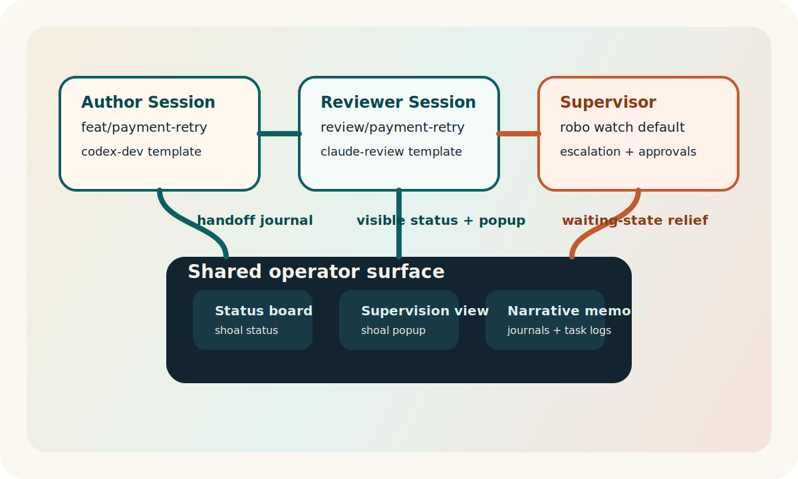
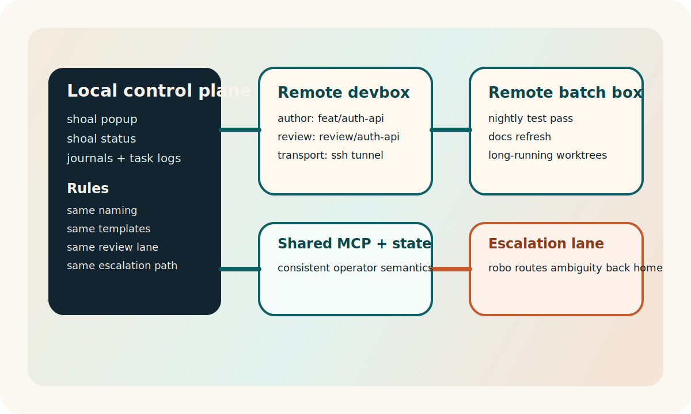

<div class="shoal-page-head">
  <p class="shoal-eyebrow">Operate Shoal</p>
  <p class="shoal-page-lede">
    Build the operator environment that keeps multiple agents legible: stable topology, fast
    supervision, durable journals, and explicit human checkpoints.
  </p>
</div>

# Flow-State Workflows

Shoal is not just a command launcher. At its best, it becomes a terminal interface for distributed
attention: one place to stage intent, route work, supervise approvals, and keep yourself in flow.

## Design target

The highest-leverage Shoal setup optimizes for four things:

1. Low-friction session creation.
2. Minimal context switching.
3. Fast approval and escalation loops.
4. Durable narrative memory through journals and stable naming.

## Build the reference environment

The intended daily-driver stack is:

- `fish` for shell-level ergonomics.
- `tmux` for persistent session topology.
- Shoal templates for repeatable session shapes.
- Journals for handoffs and longitudinal context.
- Robo supervision for waiting-state pressure relief.

The design mistake to avoid is optimizing each tool in isolation. Optimize the end-to-end loop
from "work appears" to "work is reviewed or escalated."

## Set the control plane defaults

Start with a clean `~/.config/shoal/config.toml` that reflects how you actually work:

```toml
[general]
default_tool = "codex"
worktree_dir = ".worktrees"
use_nerd_fonts = true

[tmux]
session_prefix = "_"
popup_width = "92%"
popup_height = "88%"
popup_key = "S"

[robo]
default_tool = "pi"
default_profile = "default"
session_prefix = "__"

[remote.devbox]
host = "devbox.example.com"
user = "rr"
api_port = 8080
```

The goal is to remove choice at the point where work should begin. Use defaults aggressively.

Also decide where your active attention will live:

- `shoal popup` for rapid supervision,
- a pinned tmux window for `shoal status`,
- one naming convention for sessions and branches,
- one default review topology that you can reach for without thinking.

## Design stable worker templates

The difference between "parallel terminals" and a real multi-agent system is repeatable structure.
Templates give the robo, the popup, and you a consistent mental model.

```toml
[template]
name = "codex-review"
description = "Codex worker with a terminal wingman and shared MCP"
extends = "base-dev"
tool = "codex"
mcp = ["memory"]

[template.worktree]
name = "feat/{template_name}"
create_branch = true

[[windows]]
name = "tests"

[[windows.panes]]
split = "root"
title = "runner"
command = "pytest -q"
```

Guidelines:

- Give windows semantic names, not generic ones.
- Keep the first pane as the agent pane unless there is a strong reason not to.
- Use the same template names for recurring work patterns.

## Use session topology, not session sprawl

Three patterns work especially well.

### Author, reviewer, supervisor

```bash
shoal new -t codex -w feat/auth-api -b --template codex-dev
shoal new -t claude -w review/auth-api -b --template claude-dev
shoal robo setup default --tool pi
shoal robo watch default --daemon
```

Use this when you want one agent writing, one critiquing, and one reducing approval latency.



### Planner, implementer, closer

```bash
shoal new -t pi -w plan/release-cut -b
shoal new -t codex -w feat/release-automation -b --template codex-dev
shoal new -t gemini -w docs/release-notes -b
```

Use this when the bottleneck is orchestration, not raw coding.

### Overnight batch

```bash
shoal new -t codex -w feat/cache-pass -b --template codex-dev
shoal new -t claude -w feat/test-pass -b --template claude-dev
shoal robo watch overnight-batch --daemon
```

Use this when you want work to continue while you are away, but you still need an explicit
escalation path.

## Turn journals into shared working memory

Journals are not just logs. They are the narrative layer that keeps sessions legible.

Use them for:

- intent at session start,
- decision records before risky changes,
- handoffs between author and reviewer sessions,
- escalation context for robo and remote control.

```bash
shoal journal feat/auth-api --append "Goal: split auth service and keep endpoint surface stable."
shoal journal review/auth-api --append "Review focus: regressions in error handling and config loading."
```

## Configure robo as a pressure valve

Robo is most effective when it is narrowing the gap between waiting state and forward motion.

```toml
[robo]
name = "default"
tool = "pi"
auto_approve = false

[monitoring]
poll_interval = 10
waiting_timeout = 240

[escalation]
notify = true
auto_respond = false
escalation_session = "__meta"
escalation_timeout = 300
```

Good robo behavior:

- auto-approve only genuinely safe prompts,
- escalate ambiguity quickly,
- log decisions,
- avoid becoming a silent source of hidden automation.

The robo should shorten waiting time, not make the system feel more mysterious.

## Make waiting states cheap to resolve

The fastest way to destroy flow is to let approvals pile up.

Use this loop:

1. Keep `shoal popup` nearby.
2. Treat `waiting` as a first-class queue, not an annoyance.
3. Use `shoal logs <name>` or `capture_pane` immediately.
4. Approve or redirect fast.

The point is not endless autonomy. The point is low-latency intervention.

## Build an explicit review lane

The highest-leverage teams usually separate implementation from review even when both are agent
driven.

Example:

```bash
shoal new -t codex -w feat/payment-retry -b --template codex-dev
shoal new -t claude -w review/payment-retry -b --template claude-review
shoal journal feat/payment-retry --append "Primary goal: stabilize retry semantics without widening API surface."
shoal journal review/payment-retry --append "Review for regression risk in idempotency and migration paths."
```

This creates:

- a clear author lane,
- a clear critic lane,
- a durable handoff boundary,
- faster merge confidence.

## Separate human intent from agent throughput

Human operators should keep ownership of:

- task selection,
- merge decisions,
- destructive operations,
- branch closure.

Agents should own:

- draft generation,
- repetitive edits,
- tests and diagnostics,
- first-pass reviews,
- search and summarization across the repo.

Shoal works best when those boundaries are explicit.

## Keep names and branches readable

Use names that encode role and intent:

- `feat/auth-api`
- `review/auth-api`
- `docs/auth-guide`
- `plan/release-cut`

Readable names make `shoal ls`, journals, task logs, and robo decisions easier to parse at speed.

## Remote fleets need the same discipline

When you add remote hosts, do not change the workflow shape. Reuse the same naming, templates, and
review patterns.

```bash
shoal remote connect devbox
shoal remote sessions devbox
shoal remote send devbox feat/auth-api "run the focused test subset"
```

Consistency matters more than novelty when you are operating across machines.



## Advanced configurations that actually help

These are worth adopting once the basics are stable.

### 1. Use templates for role clarity

Create separate templates for authoring, review, planning, and overnight batch work. The point is
not more templates. The point is fewer ambiguous sessions.

### 2. Keep a standing meta session

Reserve one session for orchestration, release prep, or escalation handling. This prevents your
active implementation lanes from becoming cluttered with control-plane work.

### 3. Standardize journals

Use the same structure in journal entries:

- goal,
- constraints,
- current blocker,
- next expected human decision.

That makes interruption recovery dramatically faster.

### 4. Tune supervision latency

If you work in short bursts, decrease robo polling and keep the popup bound close at hand. If you
prefer deep uninterrupted blocks, raise the polling interval and rely on a reviewer lane to catch
drift before you intervene.

### 5. Favor a few stable workflows

If a pattern happens more than twice, template it. If it happens once, do not immortalize it in
configuration. Flow state comes from repeatability, not maximal optionality.

## Developer enjoyment is an operational concern

Flow state is not fluff. It is a throughput multiplier.

Shoal should feel like:

- fewer tiny decisions,
- fewer invisible states,
- fewer terminals to babysit,
- faster recovery when an agent blocks,
- better continuity when you return to work later.

If a workflow makes the tool feel heavier, slower, or more ceremonial, simplify it. Shoal is at
its best when it disappears into the terminal and leaves only clear intent, quick feedback, and a
sense of momentum.

For a reviewer-lane contract you can reuse across tasks, see [Review Checklist](review-checklist.md).
