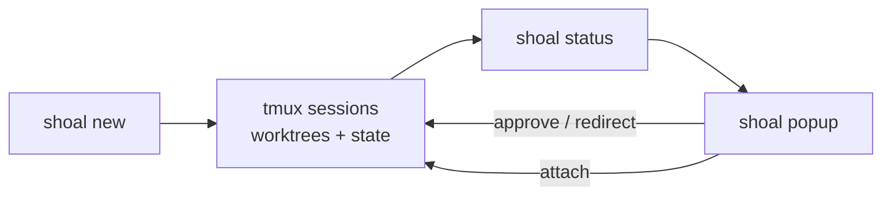

<div class="shoal-page-head" data-icon="launch">
  <p class="shoal-eyebrow">Start Here</p>
  <p class="shoal-page-lede">
    Follow this path when you want Shoal installed quickly and you want the next branching docs
    choices to stay obvious.
  </p>
</div>

# Getting Started

This path is optimized for a developer who wants Shoal working quickly. It defines the core terms you need to know, guides you through installation, and gets your first sessions running.

## Core Concepts

Before you start, understand the pieces Shoal connects:

- **Worktree**: A Git worktree. Shoal gives each agent its own isolated branch and filesystem so they can work in parallel without overwriting your current checked-out state.
- **Pane/Session**: A tmux construct. Shoal uses tmux to persist agent shells. You can attach, detach, and survive network drops.
- **MCP (Model Context Protocol)**: The standard that lets Shoal expose context and tools to agents. The `shoal-orchestrator` MCP server lets one agent inspect or control others.
- **Claw**: The orchestration service component within Shoal architecture that handles agent topologies, routing, and concurrent lifecycles (distinct from the CLI frontend).
- **Template**: A declarative configuration for a session (which shell to use, which tools to attach, what to run on startup).
- **Fin**: A lightweight protocol for passing initialization data or contracts to an agent when it starts.

<div class="shoal-step-grid">
  <div class="shoal-step" data-icon="stack">
    <strong>Check the toolchain</strong>
    <p>Confirm <code>uv</code>, <code>tmux</code>, and <code>git</code> are available before you start layering templates and shells.</p>
  </div>
  <div class="shoal-step" data-icon="launch">
    <strong>Install the CLI</strong>
    <p>Run <code>pipx install shoal-cli</code> or <code>uv tool install shoal-cli</code>. With MCP support: <code>uv tool install "shoal-cli[mcp]"</code>.</p>
  </div>
  <div class="shoal-step" data-icon="map">
    <strong>Initialize the control plane</strong>
    <p>Run <code>shoal init</code> and <code>shoal setup fish</code> to scaffold state, config, and the intended shell ergonomics.</p>
  </div>
  <div class="shoal-step" data-icon="control">
    <strong>Launch and supervise</strong>
    <p>Create the first worktrees, then use <code>shoal status</code>, <code>shoal popup</code>, and <code>shoal attach</code> to operate them.</p>
  </div>
</div>

!!! tip "MCP support"
    The `[mcp]` extra activates the `shoal-orchestrator` MCP server, which lets other AI agents create, inspect, and kill sessions directly — no shell access required.

    ```bash
    uv tool install "shoal-cli[mcp]"
    ```

## Prerequisites

Shoal assumes a terminal-centric workflow and relies on a small set of system tools.

| Tool | Why it matters |
| ---- | -------------- |
| `uv` | Installs Shoal and manages the Python environment |
| `tmux` | Runs each agent in an isolated session or pane |
| `git` | Creates worktrees and branches safely |
| `fish` | Recommended reference shell for completions, key bindings, and helper functions |
| `fzf` | Enables interactive selection in commands like `shoal attach` |

??? note "Optional tools"
    - `gh` for `shoal wt finish --pr`
    - `nvr` for Neovim integration

## Install

### From PyPI (recommended)

```bash
pipx install shoal-cli

# or with uv
uv tool install shoal-cli

# With MCP support (enables shoal-orchestrator MCP server)
uv tool install "shoal-cli[mcp]"
```

### Via Homebrew (macOS)

```bash
brew install TheShoal/tap/shoal-cli
```

This installs a self-contained binary — no Python environment required.

### Direct binary download

Download a self-contained binary from the
[latest release](https://github.com/TheShoal/shoal-cli/releases/latest):

| Platform | Asset |
| -------- | ----- |
| macOS arm64 (Apple Silicon) | `shoal-darwin-arm64` |
| macOS x86_64 (Intel) | `shoal-darwin-x86_64` |
| Linux x86_64 | `shoal-linux-x86_64` |

```bash
# Example: macOS Apple Silicon
curl -Lo shoal https://github.com/TheShoal/shoal-cli/releases/latest/download/shoal-darwin-arm64
chmod +x shoal
sudo mv shoal /usr/local/bin/
```

### From source for development

```bash
git clone https://github.com/TheShoal/shoal-cli.git
cd shoal-cli
uv tool install -e ".[dev,mcp]"
uv tool install pre-commit
just setup
```

## Initialize Shoal

```bash
shoal init
shoal setup fish
```


!!! warning "First run"
    If `shoal init` reports missing tools, fix them before running `shoal setup fish`. The fish integration assumes the state directories exist.
`shoal init` creates the XDG config, state, and runtime directories, scaffolds bundled
tool and template files, and checks the local environment. `shoal setup fish` installs the
interactive shell integration on top of that baseline.

## Launch your first sessions

```bash
shoal new -t claude -w auth -b
shoal new -t codex -w api-refactor -b
shoal new -t gemini -w docs-refresh -b
```

What those flags do:

- `-t` selects the tool profile.
- `-w` names the worktree and session.
- `-b` creates a dedicated branch automatically. When the template specifies `[template.git] branch_prefix`, that prefix replaces the default `feat/` category (e.g. `branch_prefix = "fix"` → `fix/<worktree>`). See [Local Templates — Per-Session Git Identity](LOCAL_TEMPLATES.md#per-session-git-identity).

## Check the fleet

```bash
shoal status
shoal popup
shoal attach auth
shoal ls --tree
```

Use `shoal status` for a fast summary, `shoal popup` for the interactive dashboard, and
`shoal attach` when you need to drop into a specific session directly.

## The supervision loop

Read it left to right: sessions run in the background, and you stay in flow through status and popup instead of manually watching each pane.



## Common next steps

<div class="shoal-card-grid">
  <a class="shoal-card shoal-icon-card" href="cli-reference/" data-icon="map">
    <strong>CLI Reference</strong>
    <span>See the top-level commands, subcommands, and the workflows they support.</span>
  </a>
  <a class="shoal-card shoal-icon-card" href="architecture/" data-icon="system">
    <strong>System Architecture</strong>
    <span>Understand the core services, isolation models, and atomic rollbacks.</span>
  </a>
  <a class="shoal-card shoal-icon-card" href="flow-state-workflows/" data-icon="bolt">
    <strong>Better shell ergonomics</strong>
    <span>Learn patterns for agent momentum and flow-state workflows.</span>
  </a>
</div>

- **Git identity per session**: Use `[template.git]` in your template to scope `user.name`, `user.email`, and commit template to each worktree. Set `branch_prefix` to control the default branch category for `shoal new -b`. See [Local Templates — Per-Session Git Identity](LOCAL_TEMPLATES.md#per-session-git-identity).
