# Shoal

<div class="shoal-hero">
  <div>
    <p class="shoal-eyebrow">Terminal-first orchestration for parallel AI coding agents</p>
    <h1>Run parallel agents without turning your repo into a shared-terminal mess.</h1>
    <p class="shoal-lede">
      Shoal gives each agent its own worktree, tmux session, status tracking, and shared MCP
      infrastructure so you can supervise a fleet from one CLI instead of juggling detached tabs.
    </p>
    <div class="shoal-actions">
      <a class="md-button md-button--primary" href="getting-started/">Get Started</a>
      <a class="md-button" href="cli-reference/">Browse CLI</a>
    </div>
  </div>
  <div class="shoal-hero-art">
    
  </div>
</div>



## Why Shoal exists

Shoal is built for the point where "open another terminal" stops scaling.

- You want multiple AI agents working at the same time.
- You need each agent isolated from the others at the filesystem and branch level.
- You still need one place to monitor status, approvals, errors, and MCP connectivity.
- You want automation hooks instead of copy-pasting the same setup into each session.

## What you get

<div class="shoal-card-grid">
  <a class="shoal-card" href="getting-started/">
    <strong>Fast start</strong>
    <span>Install Shoal, scaffold config, and launch a first session in minutes.</span>
  </a>
  <a class="shoal-card" href="cli-reference/">
    <strong>CLI map</strong>
    <span>See the top-level commands, subcommands, and the workflows they support.</span>
  </a>
  <a class="shoal-card" href="architecture/">
    <strong>System model</strong>
    <span>Understand how tmux, SQLite, FastAPI, and the MCP pool fit together.</span>
  </a>
  <a class="shoal-card" href="ROBO_GUIDE/">
    <strong>Robo supervision</strong>
    <span>Automate approvals, routing, and escalation with a supervisor session.</span>
  </a>
  <a class="shoal-card" href="flow-state-workflows/">
    <strong>Flow-state patterns</strong>
    <span>Design session topology, supervision loops, and shell ergonomics for momentum.</span>
  </a>
  <a class="shoal-card" href="REMOTE_GUIDE/">
    <strong>Remote fleets</strong>
    <span>Control sessions on other machines over SSH tunnels without changing the UX.</span>
  </a>
  <a class="shoal-card" href="reference/python-api/">
    <strong>Python API</strong>
    <span>Browse the current configuration, state, and MCP server internals.</span>
  </a>
</div>

## Sixty-second workflow

```bash
shoal init
shoal setup fish

shoal new -t claude -w auth -b
shoal new -t codex -w api-refactor -b
shoal new -t gemini -w docs-refresh -b

shoal status
shoal popup
shoal attach auth
```

## Documentation map

### Start here

- [Getting Started](getting-started.md) for installation, initialization, and the first real session.
- [CLI Reference](cli-reference.md) for command groups and high-signal examples.
- [Architecture](architecture.md) for the control-plane model and design boundaries.

### Workflow guides

- [Fish Integration](FISH_INTEGRATION.md) for completions, bindings, and helper functions.
- [Flow-State Workflows](flow-state-workflows.md) for high-leverage setups, templates, and supervision loops.
- [Local Templates](LOCAL_TEMPLATES.md) for project-scoped templates and mixins.
- [Remote Sessions](REMOTE_GUIDE.md) for SSH-backed control of remote fleets.
- [Robo Supervisor](ROBO_GUIDE.md) for automation patterns and escalation rules.
- [Journals](JOURNALS.md) for append-only session logs and frontmatter.
- [HTTP Transport](HTTP_TRANSPORT.md) for orchestrator transport details.

### Reference and design notes

- [Python API Reference](reference/python-api.md) for rendered module docs.
- [Implementation Audit](implementation-audit.md) for a code-versus-claims review of the current product surface.
- [Extensions](EXTENSIONS.md) and [Extensions Review](EXTENSIONS_REVIEW.md) for fin boundaries and gaps.
- [Worktree Environment Init](WORKTREE_ENV_INIT.md), [Composition Gateway](composition-gateway.md), and [Transport Spike](transport-spike.md) for design investigations.

### Project documents

- [Architecture Guide](project/architecture-guide.md) for the longer-form design rationale.
- [Contributing](project/contributing.md) for development workflow and standards.
- [Roadmap](project/roadmap.md), [Release Process](project/release-process.md), and [Changelog](project/changelog.md) for project planning and release history.

## Build the docs site locally

```bash
just docs-serve
just docs-build
```
