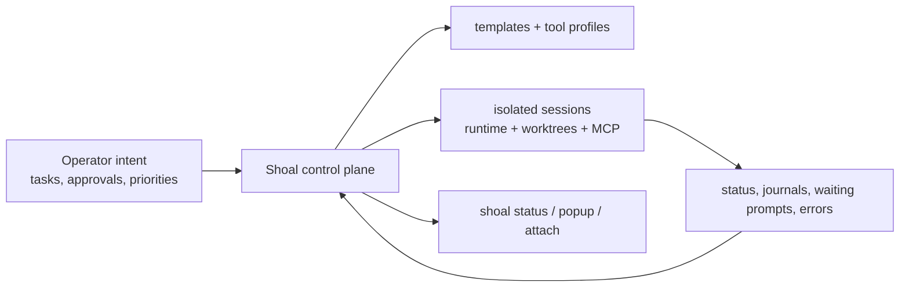

---
hide:
  - toc
---

<div class="shoal-home-heading">
  <p class="shoal-home-word">shoal</p>
  <p class="shoal-home-definition"><span>verb</span> to gather and move together.</p>
</div>

<div class="shoal-hero">
  <div>
    <p class="shoal-eyebrow">The control plane for parallel coding agents</p>
    <h1>Run a fleet of coding agents with visible state, recoverable handoffs, and human authority over every judgment call.</h1>
    <p class="shoal-lede">
      Shoal gives each agent its own worktree, provider-backed session runtime, state tracking,
      and shared MCP infrastructure — so you can supervise a parallel agent fleet from one CLI
      without losing visibility, authority, or flow. Parallel AI coding that feels like a
      controlled workflow, not a pile of threads.
      not a pile of threads.
    </p>
    <div class="shoal-actions">
      <a class="md-button md-button--primary" href="getting-started/">Get Started</a>
      <a class="md-button" href="flow-state-workflows/">Run Better Workflows</a>
    </div>
  </div>
  <div class="shoal-hero-art">
    
  </div>
</div>

## The control loop in one glance

Read it left to right: you declare work once, Shoal turns it into isolated sessions, and the resulting state flows back to one operator surface instead of scattering across tabs and terminals.


```mermaid
flowchart LR
    Intent["Operator intent<br/>tasks, approvals, priorities"] --> Shoal["Shoal control plane"]
    Shoal --> Templates["templates + tool profiles"]
    Shoal --> Sessions["isolated sessions<br/>runtime + worktrees + MCP"]
    Sessions --> State["status, journals, waiting prompts, errors"]
    State --> Shoal
    Shoal --> Surface["shoal status / popup / attach"]
```

## Why Shoal exists

Shoal is built for the point where "open another terminal" stops scaling.

- You want multiple AI agents working in parallel without stomping on each other's files.
- You need each agent isolated from the others at the filesystem and branch level.
- You still need one place to monitor status, approvals, errors, and MCP connectivity.
- You want recoverable handoffs — not just raw thread history — when you step away.
- You want automation hooks instead of copy-pasting the same setup into each session.

## Shoal is not another coding agent

Shoal does not compete with Claude Code, Codex, Pi, Gemini, or OpenCode. It is the layer
above the agent interface and runtime where supervision, state, topology, handoffs, and
control live.

Think of the stack in layers: the runtime executes and enforces its own sandbox or
permission model; Shoal operates above it as the operator surface.
- **Not a better model.** Use whichever agent you want — Shoal runs them all.
- **Not a better editor.** The terminal is the surface; Shoal makes it legible.
- **Not a desktop app.** The control plane runs in your terminal and survives SSH, overnight
  runs, and remote fleets without changing the UX.

The move Shoal makes: give serious developers a way to operate multiple coding agents as a
coherent system instead of a growing pile of chat threads.

## What Shoal is really designing

Shoal is a control plane for human-AI collaboration at the terminal.

That means secure runtimes such as OpenShell can fit cleanly underneath Shoal: Shoal can
coordinate them, but runtime security stays with the runtime.

- Templates reduce setup friction before work starts.
- Tmux topology keeps multiple sessions visible and recoverable.
- Robo handles waiting-state pressure without hiding approvals.
- Journals preserve narrative memory so interruptions are cheap.
- Naming conventions turn session lists into a readable operations board.
- Remote tunnels let you operate fleets on other machines without changing the UX.

## What you get

<div class="shoal-card-grid">
  <a class="shoal-card shoal-icon-card" href="getting-started/" data-icon="launch">
    <strong>Fast start</strong>
    <span>Install Shoal, scaffold config, and launch a first session in minutes.</span>
  </a>
  <a class="shoal-card shoal-icon-card" href="cli-reference/" data-icon="map">
    <strong>CLI map</strong>
    <span>See the top-level commands, subcommands, and the workflows they support.</span>
  </a>
  <a class="shoal-card shoal-icon-card" href="architecture/" data-icon="system">
    <strong>System model</strong>
    <span>Understand how runtime providers, SQLite, FastAPI, and the MCP pool fit together.</span>
  </a>
  <a class="shoal-card shoal-icon-card" href="terminal-interaction-design/" data-icon="compass">
    <strong>Interaction design</strong>
    <span>See how Shoal turns naming, topology, visibility, and approvals into a usable human loop.</span>
  </a>
  <a class="shoal-card shoal-icon-card" href="ROBO_GUIDE/" data-icon="control">
    <strong>Robo supervision</strong>
    <span>Automate approvals, routing, and escalation with a supervisor session.</span>
  </a>
  <a class="shoal-card shoal-icon-card" href="flow-state-workflows/" data-icon="loop">
    <strong>Flow-state patterns</strong>
    <span>Design session topology, supervision loops, and shell ergonomics for momentum.</span>
  </a>
  <a class="shoal-card shoal-icon-card" href="operator-playbooks/" data-icon="bolt">
    <strong>Operator playbooks</strong>
    <span>Adopt concrete daily patterns for triage, feature work, remote execution, and release control.</span>
  </a>
  <a class="shoal-card shoal-icon-card" href="team-doctrine/" data-icon="team">
    <strong>Team doctrine</strong>
    <span>Standardize naming, review lanes, journals, and escalation rules across the whole crew.</span>
  </a>
  <a class="shoal-card shoal-icon-card" href="review-checklist/" data-icon="review">
    <strong>Review checklist</strong>
    <span>Give reviewer sessions a concrete risk-first contract instead of vague “look it over” work.</span>
  </a>
  <a class="shoal-card shoal-icon-card" href="REMOTE_GUIDE/" data-icon="remote">
    <strong>Remote fleets</strong>
    <span>Control sessions on other machines over SSH tunnels without changing the UX.</span>
  </a>
  <a class="shoal-card shoal-icon-card" href="reference/python-api/" data-icon="stack">
    <strong>Python API</strong>
    <span>Browse the current configuration, state, and MCP server internals.</span>
  </a>
</div>

## Sixty-second workflow

```bash
# Install once
pipx install shoal-cli

# Initialize and set up shell integration
shoal init
shoal setup fish

# Spin up three parallel agents on separate worktrees
shoal new -t claude -w auth -b
shoal new -t claude -w api-refactor -b
shoal new -t claude -w docs-refresh -b

# Supervise
shoal status
shoal popup
shoal attach auth
```

## Operating principles

<div class="shoal-principles">
  <div class="shoal-principle">
    <strong>Bias toward defaulted starts</strong>
    <span>Sessions should open faster than you can second-guess the setup.</span>
  </div>
  <div class="shoal-principle">
    <strong>Keep state visible</strong>
    <span>Status, waiting prompts, and handoff context should stay one gesture away.</span>
  </div>
  <div class="shoal-principle">
    <strong>Name work like an operator</strong>
    <span>Readable session names turn the fleet into a working board instead of a pile of panes.</span>
  </div>
  <div class="shoal-principle">
    <strong>Make interruption cheap</strong>
    <span>Journals, templates, and role-separated sessions should preserve narrative continuity.</span>
  </div>
  <div class="shoal-principle">
    <strong>Keep authority human</strong>
    <span>Agents should increase throughput, not silently absorb judgment calls.</span>
  </div>
</div>

## Signature operating modes

<div class="shoal-band">
  <div class="shoal-icon-panel" data-icon="team">
    <p class="shoal-eyebrow">Mode 01</p>
    <h3>Author, reviewer, supervisor</h3>
    <p>One agent writes, one critiques, and robo keeps the approval loop short.</p>
  </div>
  <div class="shoal-icon-panel" data-icon="compass">
    <p class="shoal-eyebrow">Mode 02</p>
    <h3>Planner, implementer, closer</h3>
    <p>Use this when orchestration and decision sequencing matter more than raw code throughput.</p>
  </div>
  <div class="shoal-icon-panel" data-icon="remote">
    <p class="shoal-eyebrow">Mode 03</p>
    <h3>Local control, remote execution</h3>
    <p>Keep one operator surface while sending long-running work to remote boxes and batch lanes.</p>
  </div>
</div>

## Documentation map

### Start here

- [Getting Started](getting-started.md) for installation, initialization, and the first real session.
- [CLI Reference](cli-reference.md) for command groups and high-signal examples.

### Operate Shoal

- [Flow-State Workflows](flow-state-workflows.md) for high-leverage setups, templates, and supervision loops.
- [Operator Playbooks](operator-playbooks.md) for concrete day-to-day operating patterns.
- [Team Doctrine](team-doctrine.md) for naming, review, and escalation rules that hold up across a team.
- [Review Checklist](review-checklist.md) for a reusable risk-first review contract.
- [Robo Supervisor](ROBO_GUIDE.md) for automation patterns and escalation rules.
- [Remote Sessions](REMOTE_GUIDE.md) for SSH-backed control of remote fleets.
- [Fish Integration](FISH_INTEGRATION.md) for completions, bindings, and helper functions.
- [Local Templates](LOCAL_TEMPLATES.md) for project-scoped templates and mixins.
- [Journals](JOURNALS.md) for append-only session logs and frontmatter.
- [HTTP Transport](HTTP_TRANSPORT.md) for orchestrator transport details.
- [Troubleshooting](TROUBLESHOOTING.md) for failure recovery and environment fixes.

### Design the loop

- [Terminal Interaction Design](terminal-interaction-design.md) for the operating philosophy behind
  naming, topology, approvals, and interruption recovery.
- [Architecture](architecture.md) for the control-plane model and design boundaries.
- [Implementation Audit](implementation-audit.md) for a code-versus-claims review of the current product surface.

### Reference

- [Python API Reference](reference/python-api.md) for rendered module docs.
- [Extensions](EXTENSIONS.md) and [Extensions Review](EXTENSIONS_REVIEW.md) for fin boundaries and gaps.

### Project records

- [Contributing](project/contributing.md) for development workflow and standards.
- [Roadmap](project/roadmap.md), [Release Process](project/release-process.md), and [Changelog](project/changelog.md) for project planning and release history.
- [Architecture Guide](project/architecture-guide.md), [Worktree Environment Init](WORKTREE_ENV_INIT.md),
  [Composition Gateway](composition-gateway.md), and [Transport Spike](transport-spike.md) for deeper design investigations.

## Build the docs site locally

```bash
just docs-serve
just docs-build
```
