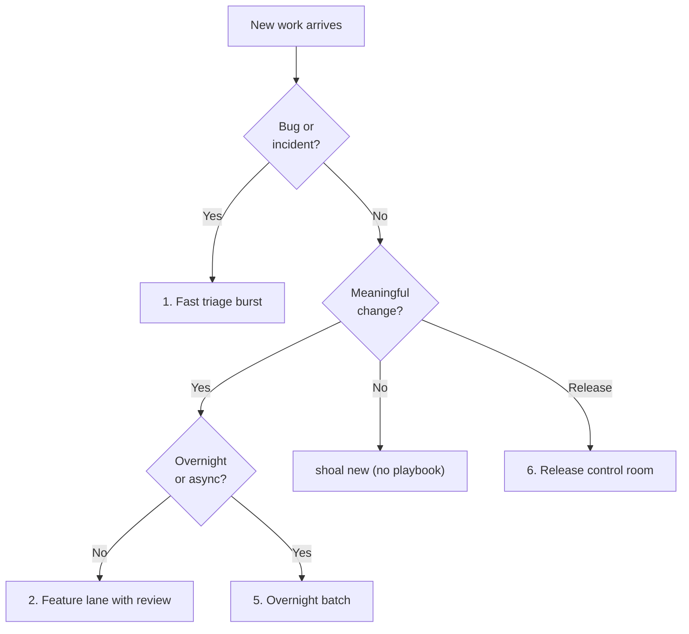

<div class="shoal-page-head" data-icon="control">
  <p class="shoal-eyebrow">Operate Shoal</p>
  <p class="shoal-page-lede">
    Use these playbooks as reusable operating modes for triage, feature lanes, release work,
    remote execution, and overnight throughput.
  </p>
</div>

# Operator Playbooks

Shoal is easiest to adopt when you stop thinking in commands and start thinking in operating
patterns. These playbooks are opinionated defaults for common high-leverage modes.

## Quick mode shortcuts

For the first session in a lane, `shoal new --mode ...` can prefill one-session defaults:

```bash
shoal new --mode feature-lane
shoal new --mode author-review --name auth-review
shoal new --mode remote-batch --name cache-pass
shoal new --mode planner -w plan/auth-redesign -b
shoal new --mode implementer -w impl/auth-tokens -b
shoal new --mode reviewer -w review/auth-pr -b
```

Run `shoal mode ls` to see all available modes with their templates, prefixes, and auto-tags.

These are single-session defaults only. They do not create the whole multi-session topology for you.

<div class="shoal-step-grid shoal-step-grid--plain">
  <div class="shoal-step">
    <strong>Fast triage burst</strong>
    <p>Split reproduction from critique when you need answers faster than architecture.</p>
  </div>
  <div class="shoal-step">
    <strong>Feature lane with review</strong>
    <p>Pair author and reviewer sessions up front when the change is meaningful enough to need both.</p>
  </div>
  <div class="shoal-step">
    <strong>Planner, implementer, closer</strong>
    <p>Use role separation when sequencing and release control are the real bottlenecks.</p>
  </div>
  <div class="shoal-step">
    <strong>Remote execution</strong>
    <p>Send heavy work elsewhere without changing naming, templates, or escalation semantics.</p>
  </div>
  <div class="shoal-step">
    <strong>Overnight batch</strong>
    <p>Keep throughput moving while you are away, but preserve explicit checkpoints and escalation.</p>
  </div>
  <div class="shoal-step">
    <strong>Release control room</strong>
    <p>Hold the merge and release decision surface in one human-owned place when risk is concentrated.</p>
  </div>
</div>

Use this to pick the right operating mode before you start.



## 1. Fast triage burst

Use this when a bug report lands and you need answers before architecture.

```bash
# 1. Spawn a dedicated repro session
shoal new --mode implementer --name triage-repro
shoal attach triage-repro
# Operator tells agent: "Use the attached script to reproduce the login timeout on staging. Find the bottleneck."

# 2. Spawn a separate session to check regression surface
shoal new --mode reviewer --name triage-review
shoal attach triage-review
# Operator tells agent: "Read recent commits affecting the auth module. Is there any obvious rate limiting or connection pool change that would cause timeouts?"

# 3. Monitor both via dashboard
shoal popup
```

## 2. Feature lane with built-in review

Use this when the work is meaningful enough that you already know review will matter, and you want to separate authoring from critique.

```bash
# 1. Start the feature author session
shoal new --mode feature-lane --name feat-payment-retry
shoal journal feat-payment-retry --append "Goal: stabilize retry semantics without widening API surface."
shoal attach feat-payment-retry
# Operator tells agent: "Read the journal and implement. Start with idempotency keys."

# 2. Spin up the reviewer in a parallel worktree when necessary
shoal new --mode author-review --name review-payment-retry
shoal attach review-payment-retry
# Operator tells agent: "Review feat-payment-retry. Focus on idempotency limits and migration safety."

# 3. Quickly check both lanes without attaching
shoal status
```

## 3. Planner, implementer, closer

Use this when sequencing, scope control, or release orchestration is the real bottleneck. Separate the agent planning high-level context from the agent writing individual steps.

```bash
# 1. The Planner: works out sequence, merges status, updates the issue
shoal new --mode planner --name plan-release-cut
shoal attach plan-release-cut
# Operator tells agent: "Break down the release cut epic into 3 implementer tasks."

# 2. The Implementer: receives the exact slice, executes code
shoal new --mode implementer --name impl-release-script
shoal journal impl-release-script --append "Task 1 from planner."
shoal attach impl-release-script
# Operator tells agent: "Execute the task passed in your journal."

# 3. The Reviewer/Closer: ensures it fits before merging
shoal new --mode reviewer --name review-release-cut
shoal attach review-release-cut
# Operator tells agent: "Review impl-release-script against plan-release-cut acceptance criteria."
```

## 4. Remote execution without workflow drift

Use this when the work is heavy enough for another machine but you do not want a second operating
model.

```bash
# 1. Start SSH tunnel
shoal remote connect devbox

# 2. Local session tracks it, remote does the heavy lifting
shoal new --mode remote-batch --name batch-reindex
shoal remote send devbox batch-reindex "run the full exhaustive benchmark suite"

# 3. List what's out there
shoal remote sessions devbox

# 4. Hop in if you need to debug test failures
shoal remote attach devbox batch-reindex
```

Rules:

- keep the same session names locally and remotely,
- reuse the same templates,
- keep escalation routed back to the local operator surface.
## 5. Overnight batch

Use this when you want throughput while you are away, but not silent chaos.

```bash
# 1. Setup the workers: one author, one reviewer
shoal new --mode feature-lane --name overnight-impl
shoal new --mode author-review --name overnight-review

# 2. Tell them what to do
shoal journal overnight-impl --append "Goal: migrate all integer IDs to UUIDv4. Stop if tests fail."
shoal journal overnight-review --append "Goal: ensure no integer casts are missed. Check SQL migrations."

# 3. Put a supervisor in charge and go to sleep
shoal new --template robo-orchestrator --name overnight-robo
shoal robo setup overnight-robo --tool pi
shoal robo watch overnight-robo --daemon
```

Before you step away:

- leave a journal entry describing success conditions,
- set an escalation timeout,
- make sure the reviewer lane is explicit,
- avoid open-ended tasks with no human checkpoint.

!!! danger "Before you walk away"
    - Leave a journal entry with explicit success conditions.
    - Set an escalation timeout on the robo profile.
    - Ensure a reviewer lane exists — do not run overnight with no critique path.
    - Avoid open-ended tasks with no human checkpoint.

## 6. Release cut control room

Use this when several moving pieces need a human-owned merge and release decision.

```bash
# 1. The Room: the human-owned planner session tracking checklist
shoal new --mode planner --name release-control
shoal attach release-control
# Operator tells agent: "We need release notes, bump versions, and a final risk assessment."

# 2. Worker 1: generate release notes
shoal new --mode implementer --name rel-notes
shoal journal rel-notes --append "Draft release notes from commits since v1.2."
shoal attach rel-notes

# 3. Worker 2: perform final QA or risk assessment
shoal new --mode reviewer --name rel-qa
shoal attach rel-qa
# Operator tells agent: "Look at the differences since v1.2. Any missing migrations?"

# 4. Bring up the dashboard to see what's done
shoal popup
```

This is where Shoal stops being a launcher and becomes a control room.

## 7. Secure fleet with sandboxed runtimes

When running agents against sensitive codebases or infrastructure, combine Shoal's
fleet control with a sandboxed runtime (OpenShell-class environments, Docker, or similar).
Shoal manages the fleet. The runtime constrains each worker.

```bash
# Launch workers with a tool profile that wraps your sandboxed runtime
shoal new --mode feature-lane --tool opencode --name payments-impl
shoal new --mode author-review --tool opencode --name payments-review

# Supervisor watches both, escalates on block
shoal new --template robo-orchestrator --tool pi --name payments-robo
```

The tool config (`~/.config/shoal/tools/opencode.toml`) points to whatever
sandboxed runner your security posture requires — Shoal doesn't care what
executes inside the tool, only that it responds on the expected pane.

!!! note "Layering principle"
    Shoal enforces session lifecycle, journal continuity, and operator visibility.
    The runtime enforces filesystem scope, network policy, and process isolation.
    Neither substitutes for the other.


## Configure for these playbooks

These defaults support nearly all of the patterns above:

```toml
[general]
default_tool = "codex"
worktree_dir = ".worktrees"
use_nerd_fonts = true

[tmux]
session_prefix = "_"
popup_key = "S"
popup_width = "92%"
popup_height = "88%"

[robo]
default_tool = "pi"
default_profile = "default"
session_prefix = "__"
```

## What to standardize across a team

If more than one person is using Shoal on the same codebase, standardize:

- template names,
- session naming conventions,
- journal structure,
- robo escalation expectations,
- which workflows always require a reviewer lane.

The gain is not consistency for its own sake. The gain is faster comprehension under load.

## A simple doctrine

!!! success "Three rules to keep"
    1. Every meaningful session should have a readable name.
    2. Every risky change should have a reviewer lane or explicit human checkpoint.
    3. Every workflow should be easier to resume tomorrow than to explain from memory.

For team-wide naming, review, and escalation conventions, see [Team Doctrine](team-doctrine.md).
For review-specific triage and escalation order, see [Review Checklist](review-checklist.md).
