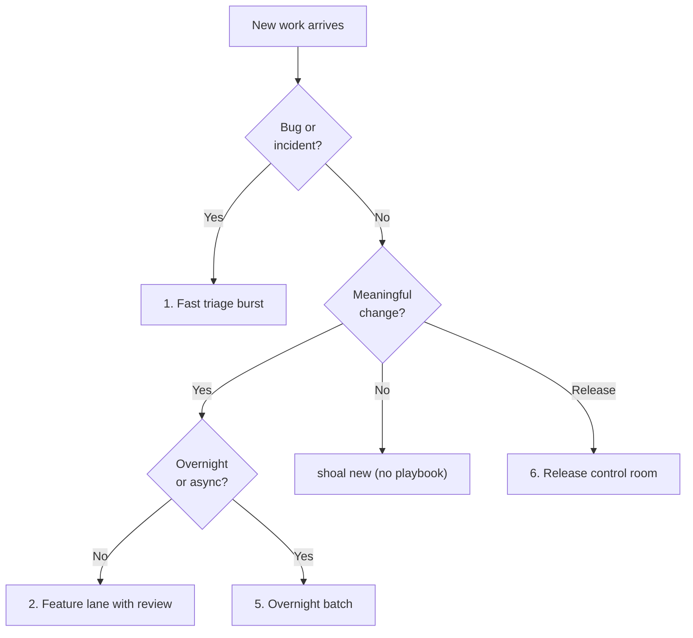

<div class="shoal-page-head" data-icon="control">
  <p class="shoal-eyebrow">Operate Shoal</p>
  <p class="shoal-page-lede">
    Use these playbooks as reusable operating modes for triage, feature lanes, release work,
    remote execution, and overnight throughput.
  </p>
</div>

# Operator Playbooks

Shoal is easiest to adopt when you stop thinking in commands and start thinking in operating
patterns. These playbooks are opinionated defaults for common high-leverage modes.

## Quick mode shortcuts

For the first session in a lane, `shoal new --mode ...` can prefill one-session defaults:

```bash
shoal new --mode feature-lane
shoal new --mode author-review --name auth-review
shoal new --mode remote-batch --name cache-pass
```

These are single-session defaults only. They do not create the whole multi-session topology for you.

<div class="shoal-step-grid shoal-step-grid--plain">
  <div class="shoal-step">
    <strong>Fast triage burst</strong>
    <p>Split reproduction from critique when you need answers faster than architecture.</p>
  </div>
  <div class="shoal-step">
    <strong>Feature lane with review</strong>
    <p>Pair author and reviewer sessions up front when the change is meaningful enough to need both.</p>
  </div>
  <div class="shoal-step">
    <strong>Planner, implementer, closer</strong>
    <p>Use role separation when sequencing and release control are the real bottlenecks.</p>
  </div>
  <div class="shoal-step">
    <strong>Remote execution</strong>
    <p>Send heavy work elsewhere without changing naming, templates, or escalation semantics.</p>
  </div>
  <div class="shoal-step">
    <strong>Overnight batch</strong>
    <p>Keep throughput moving while you are away, but preserve explicit checkpoints and escalation.</p>
  </div>
  <div class="shoal-step">
    <strong>Release control room</strong>
    <p>Hold the merge and release decision surface in one human-owned place when risk is concentrated.</p>
  </div>
</div>

Use this to pick the right operating mode before you start.



## 1. Fast triage burst

Use this when a bug report lands and you need answers before architecture.

```bash
shoal new -t codex -w triage/login-timeout -b
shoal new -t claude -w review/login-timeout -b
shoal status
shoal popup
```

Operator rules:

- keep one session focused on reproduction,
- keep one session focused on critique and likely regression surface,
- decide quickly whether this is a patch, rollback, or deeper incident.

## 2. Feature lane with built-in review

Use this when the work is meaningful enough that you already know review will matter.

```bash
shoal new -t codex -w feat/payment-retry -b --template codex-dev
shoal new -t claude -w review/payment-retry -b --template claude-review
shoal journal feat/payment-retry --append "Goal: stabilize retry semantics without widening API surface."
shoal journal review/payment-retry --append "Focus: idempotency, migrations, API drift."
```

Best effect comes from naming symmetry. The reviewer session should obviously belong to the author
session.

## 3. Planner, implementer, closer

Use this when sequencing, scope control, or release orchestration is the real bottleneck.

```bash
shoal new -t pi -w plan/release-cut -b
shoal new -t codex -w feat/release-automation -b --template codex-dev
shoal new -t gemini -w docs/release-notes -b
```

Keep the planner session human-facing. It should hold the task list, sequencing decisions, and
merge criteria.

## 4. Remote execution without workflow drift

Use this when the work is heavy enough for another machine but you do not want a second operating
model.

```bash
shoal remote connect devbox
shoal new -t codex -w feat/index-rebuild -b --template codex-dev
shoal remote send devbox feat/index-rebuild "run the focused benchmark set"
shoal remote sessions devbox
```

Rules:

- keep the same session names locally and remotely,
- reuse the same templates,
- keep escalation routed back to the local operator surface.

## 5. Overnight batch

Use this when you want throughput while you are away, but not silent chaos.

```bash
shoal new -t codex -w feat/cache-pass -b --template codex-dev
shoal new -t claude -w feat/test-pass -b --template claude-dev
shoal robo setup overnight-batch --tool pi
shoal robo watch overnight-batch --daemon
```

Before you step away:

- leave a journal entry describing success conditions,
- set an escalation timeout,
- make sure the reviewer lane is explicit,
- avoid open-ended tasks with no human checkpoint.

!!! danger "Before you walk away"
    - Leave a journal entry with explicit success conditions.
    - Set an escalation timeout on the robo profile.
    - Ensure a reviewer lane exists — do not run overnight with no critique path.
    - Avoid open-ended tasks with no human checkpoint.

## 6. Release cut control room

Use this when several moving pieces need a human-owned merge and release decision.

```bash
shoal new -t pi -w plan/release-cut -b
shoal new -t codex -w feat/release-notes -b
shoal new -t claude -w review/release-risk -b
shoal status
shoal popup
```

This is where Shoal stops being a launcher and becomes a control room.

## 7. Secure fleet with sandboxed runtimes

When running agents against sensitive codebases or infrastructure, combine Shoal's
fleet control with a sandboxed runtime (OpenShell-class environments, Docker, or similar).
Shoal manages the fleet. The runtime constrains each worker.

```bash
# Launch workers with a tool profile that wraps your sandboxed runtime
shoal new --mode feature-lane --tool opencode --name payments-impl
shoal new --mode author-review --tool opencode --name payments-review

# Supervisor watches both, escalates on block
shoal new --template robo-orchestrator --tool pi --name payments-robo
```

The tool config (`~/.config/shoal/tools/opencode.toml`) points to whatever
sandboxed runner your security posture requires — Shoal doesn't care what
executes inside the tool, only that it responds on the expected pane.

!!! note "Layering principle"
    Shoal enforces session lifecycle, journal continuity, and operator visibility.
    The runtime enforces filesystem scope, network policy, and process isolation.
    Neither substitutes for the other.


## Configure for these playbooks

These defaults support nearly all of the patterns above:

```toml
[general]
default_tool = "codex"
worktree_dir = ".worktrees"
use_nerd_fonts = true

[tmux]
session_prefix = "_"
popup_key = "S"
popup_width = "92%"
popup_height = "88%"

[robo]
default_tool = "pi"
default_profile = "default"
session_prefix = "__"
```

## What to standardize across a team

If more than one person is using Shoal on the same codebase, standardize:

- template names,
- session naming conventions,
- journal structure,
- robo escalation expectations,
- which workflows always require a reviewer lane.

The gain is not consistency for its own sake. The gain is faster comprehension under load.

## A simple doctrine

!!! success "Three rules to keep"
    1. Every meaningful session should have a readable name.
    2. Every risky change should have a reviewer lane or explicit human checkpoint.
    3. Every workflow should be easier to resume tomorrow than to explain from memory.

For team-wide naming, review, and escalation conventions, see [Team Doctrine](team-doctrine.md).
For review-specific triage and escalation order, see [Review Checklist](review-checklist.md).
