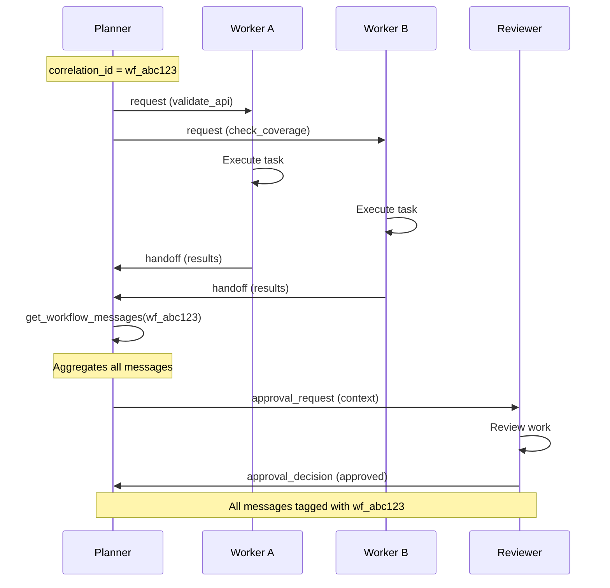

# Multi-Agent Coordination with the Agent Bus

The **Agent Bus** provides a typed, correlation-tracked message passing system for coordinating multiple Shoal sessions. This guide demonstrates when to use the bus, how to structure multi-agent workflows, and how it compares to alternative approaches.

## When to Use the Agent Bus

Use the Agent Bus when you need:

- **Cross-session coordination**: Multiple agents working on related tasks that need to share context
- **Workflow tracking**: Correlation IDs that trace multi-step processes across session boundaries
- **Typed communication**: Semantic message types (request, handoff, approval_decision, etc.) for clarity
- **Event-driven patterns**: Agents waiting for specific message types without polling sessions directly
- **Audit trails**: Complete message history for debugging and workflow reconstruction

**Don't use the Agent Bus** for:

- Simple keyboard input to a single session → use `send_keys`
- Direct MCP tool calls → use MCP server methods directly
- Local subprocess coordination → use asyncio primitives

## Core Concepts

### Message Envelope

Every message on the Agent Bus has a rich envelope with 8 fields:

```python
from shoal.models.message import MessageEnvelope, MessageKind

envelope = MessageEnvelope(
    from_session="planner",
    to_session="worker-a",
    topic="code-review",
    kind="request",  # Semantic message type
    payload='{"task": "validate_endpoints"}',  # JSON string
    correlation_id="wf_abc123",  # Workflow identifier
    reply_to_message_id=42,  # Thread messages together
    priority=2,  # 1 (highest) - 5 (lowest)
    requires_ack=True,  # Request explicit acknowledgment
    metadata_json='{"workflow": "ci-review"}',  # Optional metadata
)
```

### Message Kinds

The bus supports 7 semantic message types:

| Kind | Purpose | Example Use Case |
|------|---------|------------------|
| `event` | Informational broadcast | Status updates, notifications |
| `request` | Actionable work item | "Review these files", "Run tests" |
| `response` | Reply to a request | "Review complete", "Tests passed" |
| `handoff` | Work completion signal | Worker → Planner after task done |
| `approval_request` | Request for approval | Planner → Reviewer with context |
| `approval_decision` | Approval or rejection | Reviewer → Planner with decision |
| `error` | Error or failure signal | Task failed, timeout, exception |

### Correlation IDs

Correlation IDs trace multi-step workflows across session boundaries:

```python
# Generate once at workflow start
correlation_id = f"wf_{uuid.uuid4().hex[:12]}"

# All messages in the workflow share this ID
await send_message(..., correlation_id=correlation_id)

# Retrieve entire workflow history
all_messages = await get_workflow_messages(correlation_id)
```

## Complete Workflow Example

Here's a planner-worker-reviewer pattern demonstrating the full Agent Bus API.

### Message Flow Diagram



### 1. Planner: Orchestrate Work

```python
from shoal.core.message_bus import (
    send_message,
    watch_messages,
    get_workflow_messages,
    mark_consumed,
)

async def planner_session(correlation_id: str) -> None:
    # Step 1: Send parallel requests to workers
    await send_message(
        from_session="planner",
        to_session="worker-a",
        topic="code-review",
        payload='{"task": "validate_api_endpoints"}',
        kind="request",
        correlation_id=correlation_id,
        priority=2,
    )
    
    await send_message(
        from_session="planner",
        to_session="worker-b",
        topic="code-review",
        payload='{"task": "check_test_coverage"}',
        kind="request",
        correlation_id=correlation_id,
        priority=2,
    )
    
    # Step 2: Wait for handoffs from workers
    # watch_messages() polls until messages arrive or timeout
    handoffs = await watch_messages(
        session="planner",
        kind="handoff",
        correlation_id=correlation_id,
        timeout_seconds=30.0,
        poll_interval=0.5,
    )
    
    # Mark messages as consumed to prevent reprocessing
    for msg in handoffs:
        await mark_consumed(msg["id"])
    
    # Step 3: Aggregate full workflow context
    # Retrieves ALL messages with this correlation_id
    all_messages = await get_workflow_messages(correlation_id)
    
    # Step 4: Forward to reviewer with aggregated context
    await send_message(
        from_session="planner",
        to_session="reviewer",
        topic="approval",
        payload=json.dumps({
            "workflow_id": correlation_id,
            "results": [json.loads(m["payload"]) for m in all_messages],
        }),
        kind="approval_request",
        correlation_id=correlation_id,
    )
    
    # Step 5: Wait for approval decision
    decision = await watch_messages(
        session="planner",
        kind="approval_decision",
        correlation_id=correlation_id,
        timeout_seconds=30.0,
    )
```

### 2. Worker: Execute and Report

```python
async def worker_session(worker_id: str, correlation_id: str) -> None:
    # Poll for incoming requests
    messages = await receive_messages(
        session=f"worker-{worker_id}",
        kind="request",
        correlation_id=correlation_id,
        unconsumed_only=True,  # Only new messages
    )
    
    for msg in messages:
        task = json.loads(msg["payload"])
        
        # Mark consumed BEFORE processing to prevent duplicates
        await mark_consumed(msg["id"])
        
        # Execute work
        result = await execute_task(task)
        
        # Send handoff back to planner
        await send_message(
            from_session=f"worker-{worker_id}",
            to_session="planner",
            topic="task-complete",
            payload=json.dumps(result),
            kind="handoff",
            correlation_id=correlation_id,
            reply_to_message_id=msg["id"],  # Thread messages
        )
```

### 3. Reviewer: Approve or Reject

```python
async def reviewer_session(correlation_id: str) -> None:
    # Wait for approval request
    requests = await receive_messages(
        session="reviewer",
        kind="approval_request",
        correlation_id=correlation_id,
        unconsumed_only=True,
    )
    
    for msg in requests:
        context = json.loads(msg["payload"])
        await mark_consumed(msg["id"])
        
        # Review the aggregated work
        approved = await review_work(context)
        
        # Post decision
        await send_message(
            from_session="reviewer",
            to_session="planner",
            topic="review-decision",
            payload=json.dumps({
                "approved": approved,
                "reason": "All checks passed" if approved else "Failed validation",
            }),
            kind="approval_decision",
            correlation_id=correlation_id,
            reply_to_message_id=msg["id"],
        )
```

## Best Practices

### 1. Correlation ID Strategy

**Always generate correlation IDs at the workflow entry point:**

```python
import uuid

# At workflow start
correlation_id = f"wf_{uuid.uuid4().hex[:12]}"

# Or use semantic prefixes
correlation_id = f"ci_review_{commit_sha[:8]}"
correlation_id = f"incident_{incident_id}"
```

**Propagate through all messages:**

```python
# Every send in the workflow uses the same ID
await send_message(..., correlation_id=correlation_id)
```

### 2. Error Handling

**Always handle timeouts:**

```python
messages = await watch_messages(
    session="planner",
    kind="handoff",
    correlation_id=correlation_id,
    timeout_seconds=30.0,
)

if not messages:
    # Workflow timeout - decide on retry, escalation, or failure
    logger.warning(f"Workflow {correlation_id} timed out")
    await send_message(
        from_session="planner",
        to_session="supervisor",
        topic="workflow-timeout",
        payload=json.dumps({"correlation_id": correlation_id}),
        kind="error",
    )
```

**Use error message kind for failures:**

```python
try:
    result = await risky_operation()
except Exception as e:
    await send_message(
        from_session="worker-a",
        to_session="planner",
        topic="task-failed",
        payload=json.dumps({
            "error": str(e),
            "task": task_name,
        }),
        kind="error",
        correlation_id=correlation_id,
    )
```

### 3. Prevent Duplicate Processing

**Always mark messages as consumed:**

```python
# Consume BEFORE processing to avoid duplicates on crash/retry
messages = await receive_messages(session="worker", unconsumed_only=True)
for msg in messages:
    await mark_consumed(msg["id"])  # Mark first
    await process_message(msg)      # Then process
```

### 4. Priority and Acknowledgment

**Use priority for urgent messages:**

```python
# Critical: priority=1
await send_message(..., priority=1, kind="error")

# Normal: priority=3 (default)
await send_message(..., priority=3, kind="request")

# Low priority background: priority=5
await send_message(..., priority=5, kind="event")
```

**Request acknowledgment for critical messages:**

```python
# Send with ack required
msg_id = await send_message(
    ...,
    requires_ack=True,
)

# Recipient explicitly acknowledges
await mark_acked(msg_id)
```

### 5. Context Aggregation

**Use get_workflow_messages() to build complete context:**

```python
# Get all messages in workflow
all_messages = await get_workflow_messages(correlation_id)

# Filter by kind
requests = await get_workflow_messages(correlation_id, kind="request")
handoffs = await get_workflow_messages(correlation_id, kind="handoff")

# Incremental polling with after_id
last_id = 0
while True:
    new_messages = await get_workflow_messages(
        correlation_id,
        after_id=last_id,
    )
    if new_messages:
        last_id = new_messages[-1]["id"]
        process_new_messages(new_messages)
```

## Agent Bus vs. Alternatives

### Comparison Table

| Feature | Agent Bus | send_keys | MCP Direct |
|---------|-----------|-----------|------------|
| **Cross-session** | ✅ Built-in | ❌ Single session only | ❌ Process-bound |
| **Correlation tracking** | ✅ First-class | ❌ Manual | ❌ Manual |
| **Typed messages** | ✅ 7 semantic kinds | ❌ Plain text | ⚠️ Tool-specific |
| **Event-driven** | ✅ watch_messages() | ❌ Polling tmux | ⚠️ Depends on tool |
| **Audit trail** | ✅ Full history | ⚠️ Tmux logs | ❌ Ephemeral |
| **Workflow aggregation** | ✅ get_workflow_messages() | ❌ No | ❌ No |
| **Best for** | Multi-agent workflows | Interactive commands | Direct tool calls |

### When to Use Each

**Use Agent Bus when:**

- Coordinating 2+ sessions with shared workflow state
- Need correlation IDs for debugging/audit
- Want typed, semantic message passing
- Building event-driven agent patterns

**Use send_keys when:**

- Sending keyboard input to a single session
- Simulating user interaction with CLI
- One-off commands with no workflow context

**Use MCP directly when:**

- Calling MCP server tools from within a session
- Local tool invocation without inter-session coordination
- Tool-specific operations (git, filesystem, etc.)

### Migration Path

**From send_keys to Agent Bus:**

```python
# Before: send_keys
await send_keys(session="worker", keys="pytest tests/")

# After: Agent Bus
await send_message(
    from_session="planner",
    to_session="worker",
    topic="run-tests",
    payload='{"command": "pytest tests/"}',
    kind="request",
    correlation_id=correlation_id,
)
```

**From polling to watch_messages:**

```python
# Before: manual polling
while True:
    messages = await receive_messages(session="planner")
    if messages:
        break
    await asyncio.sleep(1)

# After: watch_messages
messages = await watch_messages(
    session="planner",
    timeout_seconds=30.0,
    poll_interval=0.5,
)
```

## Complete Example

A runnable demonstration of the complete planner-worker-reviewer pattern is available in the Shoal repository under `examples/multi_agent_workflow.py`.

The example demonstrates:

- ✅ Typed message passing (request, handoff, approval_decision)
- ✅ Correlation ID tracking across 4 sessions
- ✅ Parallel worker execution
- ✅ Context aggregation with get_workflow_messages()
- ✅ Event-driven coordination with watch_messages()
- ✅ Proper message consumption to prevent duplicates

## API Reference

### Core Functions

#### send_message()

Post a message from one session to another.

```python
async def send_message(
    from_session: str,
    to_session: str,
    topic: str,
    payload: str,
    *,
    kind: MessageKind = "event",
    correlation_id: str | None = None,
    reply_to_message_id: int | None = None,
    priority: int = 3,
    requires_ack: bool = False,
    metadata_json: str | None = None,
    expires_at: str | None = None,
) -> int:
```

**Returns**: Message ID (auto-assigned)

#### receive_messages()

Retrieve messages addressed to a session.

```python
async def receive_messages(
    session: str,
    topic: str | None = None,
    *,
    kind: str | None = None,
    correlation_id: str | None = None,
    unconsumed_only: bool = True,
    limit: int = 50,
    after_id: int | None = None,
) -> list[dict[str, object]]:
```

**Returns**: List of message dicts, oldest-first

#### watch_messages()

Poll for new messages until at least one arrives or timeout.

```python
async def watch_messages(
    session: str,
    *,
    topic: str | None = None,
    kind: str | None = None,
    correlation_id: str | None = None,
    after_id: int | None = None,
    timeout_seconds: float = 30.0,
    poll_interval: float = 0.5,
) -> list[dict[str, object]]:
```

**Returns**: All matching messages found within timeout, or empty list

#### get_workflow_messages()

Return all messages sharing a correlation ID, across all sessions.

```python
async def get_workflow_messages(
    correlation_id: str,
    *,
    kind: str | None = None,
    limit: int = 50,
    after_id: int | None = None,
) -> list[dict[str, object]]:
```

**Returns**: Matching messages in chronological order

#### mark_consumed()

Mark a message as consumed (removed from pending queue).

```python
async def mark_consumed(message_id: int) -> None:
```

#### mark_acked()

Mark a message as acknowledged (explicit confirmation of processing).

```python
async def mark_acked(message_id: int) -> None:
```

## Troubleshooting

### Messages Not Arriving

**Check unconsumed_only flag:**

```python
# Includes consumed messages (for debugging)
all_messages = await receive_messages(session="worker", unconsumed_only=False)
```

**Verify correlation_id matches:**

```python
# Query workflow to see all messages
all_workflow_messages = await get_workflow_messages(correlation_id)
print(f"Found {len(all_workflow_messages)} messages in workflow")
```

### Workflow Timeouts

**Increase timeout and reduce poll interval:**

```python
messages = await watch_messages(
    session="planner",
    timeout_seconds=60.0,  # Longer timeout
    poll_interval=0.2,      # More frequent polling
)
```

**Add intermediate status messages:**

```python
# Worker sends progress updates
await send_message(
    from_session="worker-a",
    to_session="planner",
    topic="status",
    payload='{"status": "in_progress", "progress": 0.5}',
    kind="event",
    correlation_id=correlation_id,
)
```

### Duplicate Processing

**Always mark_consumed before processing:**

```python
# CORRECT: consume first
messages = await receive_messages(session="worker", unconsumed_only=True)
for msg in messages:
    await mark_consumed(msg["id"])
    await process(msg)

# WRONG: process first (crash during processing = duplicate)
for msg in messages:
    await process(msg)
    await mark_consumed(msg["id"])  # Never reached if crash!
```

## Further Reading

- [Python API Reference](../reference/python-api.md) - Full API documentation
- [Handoffs & Modes](../handoffs-and-modes.md) - Session handoff patterns
- [Team Doctrine](../team-doctrine.md) - Multi-agent team patterns
