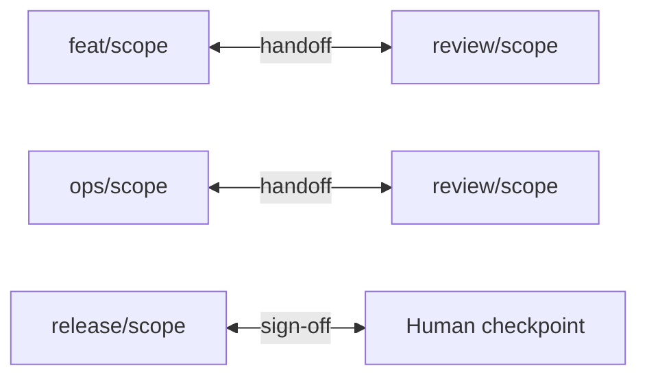

<div class="shoal-page-head" data-icon="team">
  <p class="shoal-eyebrow">Operate Shoal</p>
  <p class="shoal-page-lede">
    Standardize how the team names sessions, structures journals, routes reviews, and escalates
    ambiguity so the fleet stays readable under load.
  </p>
</div>

# Team Doctrine

Shoal gets better when a team agrees on a few operating rules instead of inventing a new ritual for
every task. This page is the minimal doctrine that keeps multi-agent work legible and reviewable.

<div class="shoal-step-grid shoal-step-grid--plain">
  <div class="shoal-step">
    <strong>Readable names</strong>
    <p>Session names should reveal role and scope fast enough that <code>shoal ls</code> reads like an operations board.</p>
  </div>
  <div class="shoal-step">
    <strong>Review symmetry</strong>
    <p>Meaningful work gets a reviewer lane or an explicit human checkpoint before risky decisions land.</p>
  </div>
  <div class="shoal-step">
    <strong>Operational journals</strong>
    <p>Write for interruption recovery, not narration, so the next operator sees goals, blockers, and decisions immediately.</p>
  </div>
  <div class="shoal-step">
    <strong>Human authority</strong>
    <p>Automation should accelerate throughput while destructive choices, merges, and policy calls stay human-owned.</p>
  </div>
  <div class="shoal-step">
    <strong>Shared templates</strong>
    <p>Use templates as team contracts for stable work modes, not as hidden bundles of one-off behavior.</p>
  </div>
</div>

## Standardize the namespace

Session names should encode role and scope immediately.

Good patterns:

- `feat/auth-api`
- `review/auth-api`
- `plan/release-cut`
- `docs/http-guide`
- `ops/devbox-recovery`

Avoid vague names like:

- `work`
- `test`
- `thing`
- `agent-2`

The point is not naming purity. The point is scanning `shoal ls` and understanding the fleet in a
single glance.

## Require review symmetry

If a task is risky enough to matter, it is risky enough to deserve an explicit reviewer lane.

Recommended pairings:

- `feat/scope` paired with `review/scope`
- `ops/scope` paired with `review/scope`
- `release/scope` paired with `review/scope`



If there is no reviewer session, there should be a clearly named human checkpoint in the journal.

## Make journals operational artifacts

Journals should answer four questions quickly:

1. What is this session trying to do?
2. What constraints matter?
3. What is blocked right now?
4. What decision is the human likely to make next?

A useful pattern:

```text
Goal:
Constraints:
Current blocker:
Next human decision:
```

Free-form notes are fine. Opaque notes are not.

## Keep authority with humans

Agents should accelerate throughput. They should not absorb responsibility for ambiguous judgment.


| Human owns | Agent owns |
| --- | --- |
| Destructive operations | Repo search and summarization |
| Merge approval | Draft implementation |
| Release approval | Repetitive edits |
| Policy changes | Diagnostics |
| Escalation resolution | First-pass review |

!!! warning "Blurring this line"
    The workflow will feel fast until it fails — usually at the worst possible moment. Keep the boundary explicit in your robo config and journal entries.

## Use templates as contracts

Templates should express stable work modes, not every local preference.

Good shared templates:

- <code>codex-dev</code>
- <code>claude-review</code>
- <code>plan-release</code>
- <code>overnight-batch</code>

Bad shared templates:

- one-off templates for single tickets,
- templates that hide critical behavior,
- templates whose names do not reveal role.

When a template is shared, it becomes part of the team interface.

## Review doctrine

The reviewer lane should not be decorative. It should have a job.

Default review priorities:

!!! info "Review priority order"
    1. Behavioral regressions.
    2. Configuration and deployment risk.
    3. Test coverage gaps.
    4. Contract drift against docs.
    5. Hidden coupling and rollback difficulty.

    That ordering matters. Style cleanup should not outrank correctness risk.

## Escalation doctrine

Robo should narrow waiting time, not erase accountability.

Team defaults should define:

- which prompts can be auto-approved,
- when ambiguity escalates,
- who owns escalation sessions,
- how decisions are logged,
- which classes of work must page a human quickly.


!!! warning
    If escalation rules are unclear, the automation layer will feel arbitrary. Document them in <code>~/.config/shoal/robo/NAME.toml</code> and in the shared template AGENTS.md.

## Remote doctrine

Remote execution should preserve the same operating shape as local execution.

Standardize:

- the same session names,
- the same review lane,
- the same journal format,
- the same escalation rules,
- the same template vocabulary.

Different machines are fine. Different semantics are not.

## Weekly hygiene

Teams using Shoal regularly should review:

- stale sessions,
- abandoned reviewer lanes,
- templates no one understands,
- journals that are too vague to resume from,
- automation rules that create surprise.

This is operational hygiene, not process theater.

## The short version


!!! success "The five rules"
    1. Name sessions so the fleet is readable.
    2. Pair meaningful work with a reviewer lane.
    3. Write journals for interruption recovery, not memoir.
    4. Keep authority human and throughput agent-driven.
    5. Standardize a few stable workflows and reuse them aggressively.

Use [Review Checklist](review-checklist.md) as the default contract for reviewer sessions.
